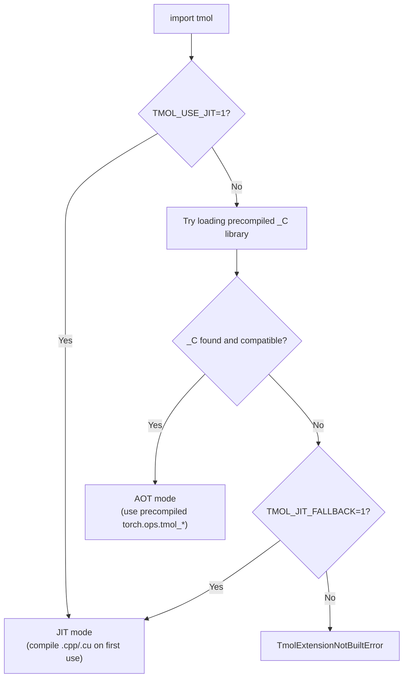

# Development Guide

This document covers building, testing, and contributing to tmol.

## Table of Contents

- [Local Setup](#local-setup)
- [Building Extensions](#building-extensions)
- [Extension Loading: AOT vs JIT](#extension-loading-aot-vs-jit)
- [Running Tests](#running-tests)
- [Containers](#containers)
- [CI Pipeline](#ci-pipeline)
- [Releasing](#releasing)
- [Code Style](#code-style)

## Local Setup

```bash
git clone https://github.com/uw-ipd/tmol.git && cd tmol
pip install -e ".[dev]"   # builds C++/CUDA extensions via CMake
```

Requirements: Python 3.11+, PyTorch 2.8+, C++17 compiler, CMake 3.18+. CUDA toolkit (`nvcc`) is optional — without it, only CPU extensions are built. Pre-built wheels are published for Python `cp311`-`cp314`.

## Building Extensions

tmol ships custom C++/CUDA kernels that are compiled via CMake (using scikit-build-core as the build backend). `pip install -e .` handles compilation automatically.

```bash
# Full build (production extensions only)
pip install -e .

# Build with test extensions
pip install -e . -Ccmake.define.TMOL_BUILD_TESTS=ON

# Target specific GPU architectures (default: "80;86;89;90")
pip install -e . -Ccmake.define.CMAKE_CUDA_ARCHITECTURES="80;90"

# Control parallelism
MAX_JOBS=4 pip install -e . -Ccmake.define.TMOL_NVCC_THREADS=2
```

CMake build options:

| Variable | Default | Description |
|----------|---------|-------------|
| `CMAKE_CUDA_ARCHITECTURES` | `80;86;89;90` | GPU compute capabilities to compile for |
| `TMOL_BUILD_TESTS` | `OFF` | Build test-only C++/CUDA extensions |
| `TMOL_NVCC_THREADS` | `4` | Threads per nvcc invocation |
| `TMOL_ENABLE_CUDA` | `ON` | Set to `OFF` for CPU-only build (no `nvcc` needed) |
| `MAX_JOBS` | auto | Max parallel compilation jobs |

## Extension Loading: AOT vs JIT

tmol's C++/CUDA kernels can be loaded in two ways:

- **AOT (Ahead-Of-Time)**: Pre-compiled `.so` libraries are bundled inside the installed package (e.g., from a wheel). Operations are registered in `torch.ops.tmol_*` namespaces. This is the default and requires no compiler at runtime.

- **JIT (Just-In-Time)**: Source files (`.cpp`, `.cu`) are compiled on first use via `torch.utils.cpp_extension.load()`. This requires `nvcc` and a C++ compiler to be available. Useful for kernel development where you want to edit and reload C++/CUDA code without rebuilding the whole package.

Two environment variables control which path is taken:

| Variable           | Effect                                                                 |
|--------------------|------------------------------------------------------------------------|
| `TMOL_USE_JIT=1`   | **Force JIT mode.** Skip AOT entirely; always compile from source.     |
| `TMOL_JIT_FALLBACK=1` | **Fallback to JIT** if the precompiled `_C` library is missing or incompatible. Silent degradation instead of an error. |

When neither variable is set, tmol tries to load the precompiled library and raises an error if it is not found.

### Pre-built wheel compatibility

Linux x86_64 release wheels are built in **manylinux_2_28** with **auditwheel** repair so they depend only on glibc/libstdc++ symbols allowed by that policy. Extensions are compiled with the same **`_GLIBCXX_USE_CXX11_ABI`** flag as the target PyTorch build (`TORCH_CXX_FLAGS` from CMake).

If `import tmol` fails with `GLIBCXX_* not found`, the host `libstdc++` is too old for the wheel — use a newer GCC module, conda `libstdcxx-ng`, a container, `TMOL_DISABLE_WHEEL_FETCH=1 pip install -e .`, or `TMOL_JIT_FALLBACK=1`.



**Typical scenarios:**

| User                          | Install method     | Env vars needed | Mode |
|-------------------------------|--------------------|-----------------|------|
| End user                      | Pre-built wheel    | None            | AOT  |
| End user                      | `pip install tmol` (sdist) | None   | AOT (compiled at install time) |
| Kernel developer              | `pip install -e .` | `TMOL_USE_JIT=1` | JIT |
| CI without GPU                | Pre-built wheel    | None            | AOT  |

### CUDA toolkit for JIT mode

JIT mode requires `nvcc` and CUDA headers. You can either:

1. **Use a CUDA-enabled container** (NGC, conda) or set `CUDA_HOME` to point to your system CUDA toolkit.
2. **Install the pip CUDA extra**, which downloads `nvcc` and runtime libraries:

```bash
pip install .[cuda]
```

## Running Tests

```bash
# All tests
pytest tmol/tests/ -v

# Specific test file
pytest tmol/tests/score/test_score_function.py -v

# Only CPU tests (skip cuda-parametrized tests)
pytest tmol/tests/ -v -k "not cuda"

# With coverage
pytest tmol/tests/ --cov=./tmol --junitxml=results.xml

# Benchmarks (disabled by default)
pytest --benchmark-enable --benchmark-only --benchmark-max-time=.1
```

### Ligand charges

Partial charges come exclusively from the SMILES -> OpenBabel MMFF94 mol2 step and
are applied to the prepared molecule by atom index (`authoritative_charges_by_index`
in `mol3d.py`). There is no RDKit/Gasteiger charge fallback and no `charge_mode`
knob: if OpenBabel cannot charge a ligand, preparation fails loudly. The validated
parameter-generation parity is the guanfeng DUD-80 SMILES suite
(`tmol/tests/ligand/test_smiles_semantic.py`,
`tmol/tests/ligand/test_serialization_consistency.py`).

### Testing a specific release

```bash
# Install matching PyTorch first (example: x86_64 manylinux cu128/torch2.10)
pip install "torch==2.10.*" --index-url https://download.pytorch.org/whl/cu128

# Install a release wheel from GitHub
pip install https://github.com/uw-ipd/tmol/releases/download/vX.Y.Z/tmol-X.Y.Z+cu128torch2.10-cp312-cp312-manylinux_2_28_x86_64.whl

# Or install a specific branch/tag from source
pip install git+https://github.com/uw-ipd/tmol.git@vX.Y.Z

# Run tests against it
pytest --pyargs tmol.tests -v
```

On Google Colab (Python 3.12, torch 2.8, Turing T4) use the `+cu128torch2.8`
wheel — it is the only variant built with `sm_75`:

```bash
pip install "https://github.com/uw-ipd/tmol/releases/download/vX.Y.Z/tmol-X.Y.Z+cu128torch2.8-cp312-cp312-linux_x86_64.whl"
```

## Containers

Container definitions install all dependencies into an NVIDIA NGC PyTorch base image that provides `torch`, `numpy`, `nvcc`, and CUDA libraries. Bind-mount your tmol checkout at runtime.

**Docker:**

```bash
docker build -t tmol-dev -f containers/docker/tmol-dev.Dockerfile .
docker run --gpus all -it -v $(pwd):/tmol_host -w /tmol_host tmol-dev bash
pip install -e .  # inside container
```

**Apptainer:**

```bash
apptainer build tmol-dev.sif containers/apptainer/tmol-dev.def
apptainer run --nv --bind $(pwd):/tmol_host tmol-dev.sif
```

## CI Pipeline

tmol uses GitHub Actions for all CI:

| Workflow | Trigger | What it does |
|----------|---------|--------------|
| `ci.yml` | Push to `master`/`kdidi/**`, PRs | Lint, test (CPU + CUDA), benchmark. Runs on a **self-hosted GPU runner** (fela) inside an Apptainer NGC container. |
| `publish.yml` | Push to `master`/`kdidi/ligand_clean`, manual | Builds wheels (GPU + CPU) + sdist, uploads sdist to TestPyPI, uploads wheels to a GitHub Release. |

### CI architecture

```
Push/PR -> GitHub Actions -> self-hosted runner (fela, bare metal)
                                  |
                                  v
                          apptainer exec --nv pytorch_25.06-py3.sif
                                  |
                                  v
                          NGC PyTorch container (GPU access)
                                  |
                                  v
                          Setup -> Lint -> Test CPU -> Test CUDA -> Benchmark
```

### Self-hosted runner

The CI GPU runner lives on `fela`. To manage it:

```bash
# Start/stop
cd /net/scratch/kdidi/actions-runner
./start.sh   # starts runner in background
./stop.sh    # stops runner

# Logs
tail -f /net/scratch/kdidi/actions-runner/runner.log
```

## Releasing

1. Bump `project.version` in `pyproject.toml`.
2. Commit and push to `master` or `kdidi/ligand_clean`:
   - `publish.yml` auto-triggers on push for these two branches.
   - You can also run `publish.yml` manually with `workflow_dispatch`.
3. Wait for workflow completion:
   - `build_wheels` (GPU matrix)
   - `build_cpu_wheel`
   - `build_sdist`
   - `upload`
4. Verify release artifacts:
   - TestPyPI sdist upload succeeds.
   - GitHub prerelease `vX.Y.Z` exists and contains all wheel files.
5. Install using explicit wheel files (recommended):
   - Install matching PyTorch/CUDA first.
   - Install from GitHub release wheel URL (or pinned `tmol==X.Y.Z+...` with `--find-links`).
6. TestPyPI install path (sdist):
   - `pip install tmol --index-url https://test.pypi.org/simple/ --extra-index-url https://pypi.org/simple/`
   - This compiles extensions at install time.

## Code Style

tmol uses [black](https://black.readthedocs.io/) for Python formatting, [flake8](https://flake8.pycqa.org/) for linting, and [clang-format](https://clang.llvm.org/docs/ClangFormat.html) for C++.

```bash
# Check formatting
black --check .

# Auto-format
black .

# Lint
flake8
```

### Pre-commit hooks

```bash
pip install -e ".[dev]"
pre-commit install
```

Pre-commit runs `clang-format` (C++) and `black` (Python) on staged files. If formatting changes are needed, the first commit attempt will fail and the tools will reformat your code. Run `git diff` to review, then `git add` and commit again.

### Pull requests

All changes to master go through pull requests. PRs are merged via squash or rebase to keep a linear history. Each PR should be an atomic unit of work.


