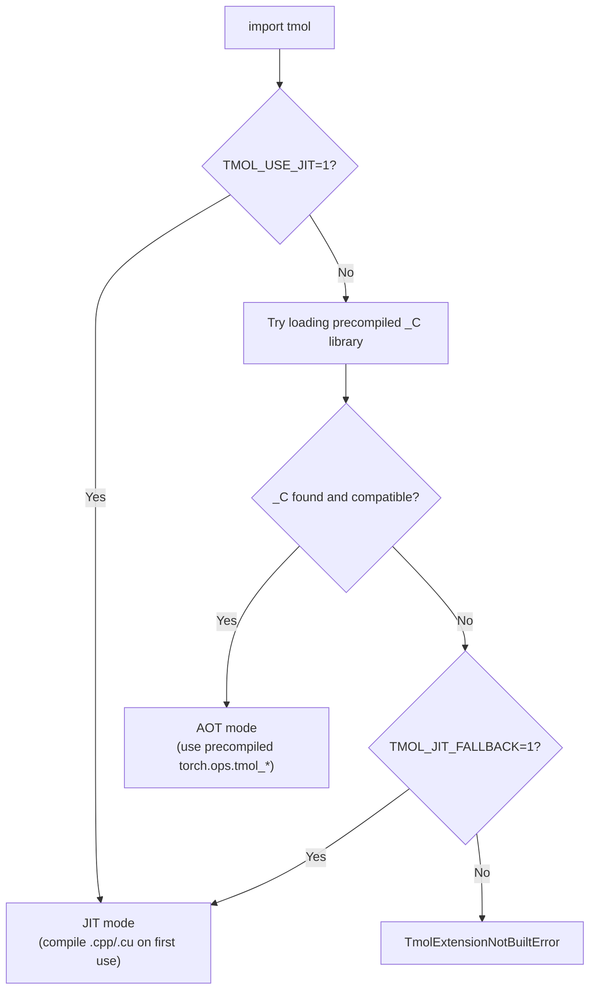

# Development Guide

This document covers building, testing, and contributing to tmol.

## Table of Contents

- [Local Setup](#local-setup)
- [Building Extensions](#building-extensions)
- [Extension Loading: AOT vs JIT](#extension-loading-aot-vs-jit)
- [Running Tests](#running-tests)
- [Containers](#containers)
- [CI Pipeline](#ci-pipeline)
- [Releasing](#releasing)
- [Code Style](#code-style)

## Local Setup

```bash
git clone https://github.com/uw-ipd/tmol.git && cd tmol
pip install -e ".[dev]"

# Build C++/CUDA extensions in-place
python setup.py build_ext --inplace
```

Requirements: Python 3.10+, PyTorch 2.5+, `nvcc` (CUDA toolkit), C++17 compiler.

## Building Extensions

tmol ships custom C++/CUDA kernels that need to be compiled. `setup.py build_ext --inplace` compiles them and places `.so` files alongside the Python source.

```bash
# Full build (production + test extensions)
python setup.py build_ext --inplace

# Skip test extensions (faster)
TMOL_SKIP_TEST_EXTS=TRUE python setup.py build_ext --inplace

# Target specific GPU architectures (default: "8.0 8.6 8.9 9.0 10.0+PTX")
TORCH_CUDA_ARCH_LIST="8.0 9.0+PTX" python setup.py build_ext --inplace

# Control parallelism
MAX_JOBS=4 NVCC_THREADS=2 python setup.py build_ext --inplace
```

Environment variables for `setup.py`:

| Variable | Default | Description |
|----------|---------|-------------|
| `TMOL_SKIP_CUDA_BUILD` | `FALSE` | Skip CUDA extension compilation entirely |
| `TMOL_SKIP_TEST_EXTS` | `FALSE` | Skip test-only extensions |
| `TMOL_FORCE_BUILD` | `FALSE` | Force rebuild even if extensions exist |
| `TMOL_FORCE_CXX11_ABI` | `FALSE` | Force C++11 ABI (for NGC container compat) |
| `TORCH_CUDA_ARCH_LIST` | `8.0 8.6 8.9 9.0 10.0+PTX` | GPU architectures to compile for |
| `MAX_JOBS` | auto | Max parallel compilation jobs |
| `NVCC_THREADS` | `4` | Threads per nvcc invocation |

## Extension Loading: AOT vs JIT

tmol's C++/CUDA kernels can be loaded in two ways:

- **AOT (Ahead-Of-Time)**: Pre-compiled `.so` libraries are bundled inside the installed package (e.g., from a wheel). Operations are registered in `torch.ops.tmol_*` namespaces. This is the default and requires no compiler at runtime.

- **JIT (Just-In-Time)**: Source files (`.cpp`, `.cu`) are compiled on first use via `torch.utils.cpp_extension.load()`. This requires `nvcc` and a C++ compiler to be available. Useful for kernel development where you want to edit and reload C++/CUDA code without rebuilding the whole package.

Two environment variables control which path is taken:

| Variable           | Effect                                                                 |
|--------------------|------------------------------------------------------------------------|
| `TMOL_USE_JIT=1`   | **Force JIT mode.** Skip AOT entirely; always compile from source.     |
| `TMOL_JIT_FALLBACK=1` | **Fallback to JIT** if the precompiled `_C` library is missing or incompatible. Silent degradation instead of an error. |

When neither variable is set, tmol tries to load the precompiled library and raises an error if it is not found.



**Typical scenarios:**

| User                          | Install method     | Env vars needed | Mode |
|-------------------------------|--------------------|-----------------|------|
| End user                      | Pre-built wheel    | None            | AOT  |
| End user                      | `pip install tmol` (sdist) | None   | AOT (compiled at install time) |
| Kernel developer              | `pip install -e .` | `TMOL_USE_JIT=1` | JIT |
| CI without GPU                | Pre-built wheel    | None            | AOT  |

### CUDA toolkit for JIT mode

JIT mode requires `nvcc` and CUDA headers. You can either:

1. **Use a CUDA-enabled container** (NGC, conda) or set `CUDA_HOME` to point to your system CUDA toolkit.
2. **Install the pip CUDA extra**, which downloads `nvcc` and runtime libraries:

```bash
pip install .[cuda]
```

## Running Tests

```bash
# All tests
pytest tmol/tests/ -v

# Specific test file
pytest tmol/tests/score/test_score_function.py -v

# Only CPU tests (skip cuda-parametrized tests)
pytest tmol/tests/ -v -k "not cuda"

# With coverage
pytest tmol/tests/ --cov=./tmol --junitxml=results.xml

# Benchmarks (disabled by default)
pytest --benchmark-enable --benchmark-only --benchmark-max-time=.1
```

### Testing a specific release

```bash
# Install a release wheel from GitHub
pip install https://github.com/uw-ipd/tmol/releases/download/v0.1.1/tmol-0.1.1+cu126torch2.8cxx11abiTRUE-cp312-cp312-linux_x86_64.whl

# Or install a specific branch/tag from source
pip install git+https://github.com/uw-ipd/tmol.git@v0.1.1

# Run tests against it
pytest --pyargs tmol.tests -v
```

## Containers

Container definitions install all dependencies into an NVIDIA NGC PyTorch base image that provides `torch`, `numpy`, `nvcc`, and CUDA libraries. Bind-mount your tmol checkout at runtime.

**Docker:**

```bash
docker build -t tmol-dev -f containers/docker/tmol-dev.Dockerfile .
docker run --gpus all -it -v $(pwd):/tmol_host -w /tmol_host tmol-dev bash
pip install -e .  # inside container
```

**Apptainer:**

```bash
apptainer build tmol-dev.sif containers/apptainer/tmol-dev.def
apptainer run --nv --bind $(pwd):/tmol_host tmol-dev.sif
```

## CI Pipeline

tmol uses GitHub Actions for all CI:

| Workflow | Trigger | What it does |
|----------|---------|--------------|
| `ci.yml` | Push to `main`/`kdidi/*`, PRs | Lint, test (CPU + CUDA), benchmark, JIT test. Runs on a **self-hosted GPU runner** (fela) inside an Apptainer NGC container. |
| `build_wheel.yml` | Push to `kdidi/precompiled_extensions` | Builds wheels across a PyTorch/CUDA/ABI matrix. Saves as artifacts (no upload). |
| `publish.yml` | Manual (`workflow_dispatch`) | Builds wheels + sdist, uploads sdist to TestPyPI, uploads wheels to a GitHub Release. |

### CI architecture

```
Push/PR -> GitHub Actions -> self-hosted runner (fela, bare metal)
                                  |
                                  v
                          apptainer exec --nv pytorch_25.06-py3.sif
                                  |
                                  v
                          NGC PyTorch container (GPU access)
                                  |
                                  v
                          Setup -> Lint -> Test CPU -> Test CUDA -> Benchmark -> JIT Test
```

### Wheel builds vs releases

- **CI wheels** (`build_wheel.yml`): Built automatically on push. Saved as GitHub Actions artifacts (temporary, expire after 90 days). These validate that the code compiles across the matrix.
- **Release wheels** (`publish.yml`): Triggered manually when you bump the version. Builds wheels and uploads them to a permanent **GitHub Release**, plus sdist to TestPyPI.

### Self-hosted runner

The CI GPU runner lives on `fela`. To manage it:

```bash
# Start/stop
cd /net/scratch/kdidi/actions-runner
./start.sh   # starts runner in background
./stop.sh    # stops runner

# Logs
tail -f /net/scratch/kdidi/actions-runner/runner.log
```

## Releasing

1. Bump version in `pyproject.toml`
2. Commit and push
3. Go to **Actions > Publish to TestPyPI > Run workflow** in the GitHub UI
4. The workflow builds all wheels, uploads sdist to TestPyPI, and creates a GitHub Release with wheels attached
5. Users install via: `pip install tmol --find-links https://github.com/uw-ipd/tmol/releases/download/vX.Y.Z/`

## Code Style

tmol uses [ruff](https://docs.astral.sh/ruff/) for Python linting and formatting, and [clang-format](https://clang.llvm.org/docs/ClangFormat.html) for C++.

```bash
# Check
ruff check .
ruff format --check .

# Auto-fix
ruff check --fix .
ruff format .
```

### Pre-commit hooks

```bash
pip install -e ".[dev]"
pre-commit install
```

Pre-commit runs `clang-format` (C++) and `ruff` (Python) on staged files. If formatting changes are needed, the first commit attempt will fail and the tools will reformat your code. Run `git diff` to review, then `git add` and commit again.

### Pull requests

All changes to main go through pull requests. PRs are merged via squash or rebase to keep a linear history. Each PR should be an atomic unit of work.


