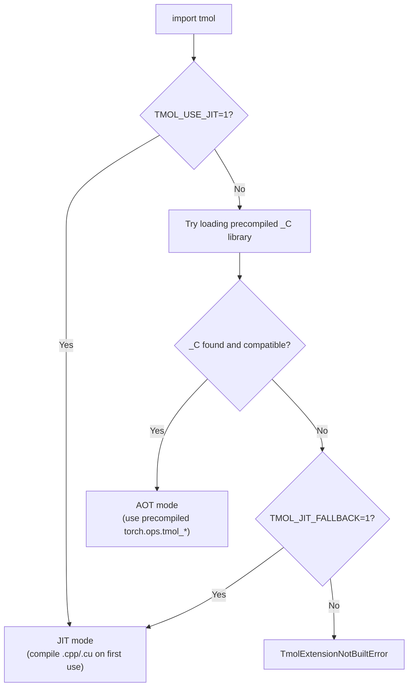

# Development Guide

This document covers building, testing, and contributing to tmol.

## Table of Contents

- [Local Setup](#local-setup)
- [Building Extensions](#building-extensions)
- [Extension Loading: AOT vs JIT](#extension-loading-aot-vs-jit)
- [Running Tests](#running-tests)
- [Containers](#containers)
- [CI Pipeline](#ci-pipeline)
- [Releasing](#releasing)
- [Code Style](#code-style)

## Local Setup

**NVIDIA GPU (Linux):**
```bash
git clone https://github.com/uw-ipd/tmol.git && cd tmol
pip install -e ".[dev]"       # builds C++/CUDA extensions via CMake
```
Requirements: Python 3.10+, PyTorch 2.5+, `nvcc` (CUDA toolkit), C++17 compiler, CMake 3.18+.

**Apple Silicon Mac (macOS):**

> [!IMPORTANT]
> MPS support lives in the **[fnachon/tmol](https://github.com/fnachon/tmol)** fork.
> Clone that repository for Apple Silicon development.

```bash
git clone https://github.com/fnachon/tmol.git && cd tmol
pip install -e ".[dev,mps]"   # builds C++/Metal extensions via CMake
```
Requirements: Python 3.10+, PyTorch 2.5+, macOS 13+, Xcode Command Line Tools (`xcode-select --install`), CMake 3.18+. No `nvcc` needed.

## Building Extensions

tmol ships custom C++/CUDA/Metal kernels compiled via CMake (using scikit-build-core as the build backend). `pip install -e .` handles compilation automatically.

```bash
# Full build — NVIDIA GPU
pip install -e .

# Full build — Apple Silicon (MPS backend)
pip install -e ".[mps]"

# Build with test extensions
pip install -e . -Ccmake.define.TMOL_BUILD_TESTS=ON

# Target specific CUDA GPU architectures (default: "80;86;89;90")
pip install -e . -Ccmake.define.CMAKE_CUDA_ARCHITECTURES="80;90"

# Control parallelism
MAX_JOBS=4 pip install -e . -Ccmake.define.TMOL_NVCC_THREADS=2
```

CMake build options:

| Variable | Default | Description |
|----------|---------|-------------|
| `CMAKE_CUDA_ARCHITECTURES` | `80;86;89;90` | CUDA GPU compute capabilities to compile for |
| `TMOL_BUILD_TESTS` | `OFF` | Build test-only C++/CUDA extensions |
| `TMOL_BUILD_MPS` | auto-detected | Build MPS (Metal) backend; auto-enabled when `xcrun` and Metal SDK are found |
| `TMOL_NVCC_THREADS` | `4` | Threads per nvcc invocation |
| `TMOL_FORCE_CXX11_ABI` | `FALSE` | Force C++11 ABI (for NGC container compat) |
| `TORCH_CUDA_ARCH_LIST` | `8.0 8.6 8.9 9.0 10.0+PTX` | GPU architectures to compile for |
| `MAX_JOBS` | auto | Max parallel compilation jobs |
| `NVCC_THREADS` | `4` | Threads per nvcc invocation |

### MPS / Metal build notes

The MPS backend is enabled automatically on macOS when `xcrun` and the Metal SDK are present (they ship with Xcode Command Line Tools). The build compiles:

- Objective-C++ (`.mm`) bridge files that call Metal API
- Metal Shading Language kernels (`.metal` → `.air` → `tmol_primitives.metallib`) for GPU-accelerated scan, reduce, and segmented scan primitives

To explicitly enable or disable the MPS backend:

```bash
# Force-enable (will fail if Metal SDK is absent)
pip install -e . -Ccmake.define.TMOL_BUILD_MPS=ON

# Force-disable (CPU-only build on macOS)
pip install -e . -Ccmake.define.TMOL_BUILD_MPS=OFF
```

## Extension Loading: AOT vs JIT

tmol's C++/CUDA kernels can be loaded in two ways:

- **AOT (Ahead-Of-Time)**: Pre-compiled `.so` libraries are bundled inside the installed package (e.g., from a wheel). Operations are registered in `torch.ops.tmol_*` namespaces. This is the default and requires no compiler at runtime.

- **JIT (Just-In-Time)**: Source files (`.cpp`, `.cu`) are compiled on first use via `torch.utils.cpp_extension.load()`. This requires `nvcc` and a C++ compiler to be available. Useful for kernel development where you want to edit and reload C++/CUDA code without rebuilding the whole package.

Two environment variables control which path is taken:

| Variable           | Effect                                                                 |
|--------------------|------------------------------------------------------------------------|
| `TMOL_USE_JIT=1`   | **Force JIT mode.** Skip AOT entirely; always compile from source.     |
| `TMOL_JIT_FALLBACK=1` | **Fallback to JIT** if the precompiled `_C` library is missing or incompatible. Silent degradation instead of an error. |

When neither variable is set, tmol tries to load the precompiled library and raises an error if it is not found.



**Typical scenarios:**

| User                          | Install method     | Env vars needed | Mode |
|-------------------------------|--------------------|-----------------|------|
| End user                      | Pre-built wheel    | None            | AOT  |
| End user                      | `pip install tmol` (sdist) | None   | AOT (compiled at install time) |
| Kernel developer              | `pip install -e .` | `TMOL_USE_JIT=1` | JIT |
| CI without GPU                | Pre-built wheel    | None            | AOT  |

### CUDA toolkit for JIT mode

JIT mode requires `nvcc` and CUDA headers. You can either:

1. **Use a CUDA-enabled container** (NGC, conda) or set `CUDA_HOME` to point to your system CUDA toolkit.
2. **Install the pip CUDA extra**, which downloads `nvcc` and runtime libraries:

```bash
pip install .[cuda]
```

### MPS / Metal and JIT mode

The MPS backend does not use JIT compilation — Metal shaders are always compiled ahead-of-time at build time via `xcrun metal`. Setting `TMOL_USE_JIT=1` on macOS still compiles the C++/Objective-C++ bridge code via `torch.utils.cpp_extension`, but the `.metallib` binary is loaded from disk. No additional environment variables are needed for MPS.

## Running Tests

```bash
# All tests
pytest tmol/tests/ -v

# Specific test file
pytest tmol/tests/score/test_score_function.py -v

# Only CPU tests (skip cuda- and mps-parametrized tests)
pytest tmol/tests/ -v -k "not cuda and not mps"

# Only MPS tests (Apple Silicon)
pytest tmol/tests/test_mps.py -v

# With coverage
pytest tmol/tests/ --cov=./tmol --junitxml=results.xml

# Benchmarks (disabled by default)
pytest --benchmark-enable --benchmark-only --benchmark-max-time=.1
```

### MPS test suite

> [!NOTE]
> MPS tests require the [fnachon/tmol](https://github.com/fnachon/tmol) fork — the upstream repository does not include MPS patches.

`tmol/tests/test_mps.py` contains a five-layer smoke test for the Apple Silicon backend:

| Layer | What it checks |
|-------|---------------|
| 1 — Tensor plumbing | MPS availability, creation, matmul, autograd |
| 2 — Primitives | cumsum, reduce, elementwise ops via PyTorch wrappers |
| 3 — Dispatch macro | Pose stack construction on MPS (exercises compiled ops) |
| 4 — Forward pass | CartBonded, Elec, LJLK, HBond, full beta2016 score function |
| 5 — CPU consistency | MPS scores and gradients match CPU within float32 tolerance |

All tests are automatically skipped on non-Apple-Silicon machines via the `@requires_mps` mark.

### Testing a specific release

```bash
# CUDA/Linux: install a release wheel from the upstream GitHub
pip install https://github.com/uw-ipd/tmol/releases/download/v0.1.1/tmol-0.1.1+cu126torch2.8cxx11abiTRUE-cp312-cp312-linux_x86_64.whl

# MPS/macOS: install a specific branch/tag from the MPS fork
pip install git+https://github.com/fnachon/tmol.git@master

# Run tests against it
pytest --pyargs tmol.tests -v
```

## Containers

Container definitions install all dependencies into an NVIDIA NGC PyTorch base image that provides `torch`, `numpy`, `nvcc`, and CUDA libraries. Bind-mount your tmol checkout at runtime.

**Docker:**

```bash
docker build -t tmol-dev -f containers/docker/tmol-dev.Dockerfile .
docker run --gpus all -it -v $(pwd):/tmol_host -w /tmol_host tmol-dev bash
pip install -e .  # inside container
```

**Apptainer:**

```bash
apptainer build tmol-dev.sif containers/apptainer/tmol-dev.def
apptainer run --nv --bind $(pwd):/tmol_host tmol-dev.sif
```

## CI Pipeline

tmol uses GitHub Actions for all CI:

| Workflow | Trigger | What it does |
|----------|---------|--------------|
| `ci.yml` | Push to `main`/`kdidi/*`, PRs | Lint, test (CPU + CUDA), benchmark, JIT test. Runs on a **self-hosted GPU runner** (fela) inside an Apptainer NGC container. |
| `build_wheel.yml` | Push to `kdidi/precompiled_extensions` | Builds wheels across a PyTorch/CUDA/ABI matrix. Saves as artifacts (no upload). |
| `publish.yml` | Manual (`workflow_dispatch`) | Builds wheels + sdist, uploads sdist to TestPyPI, uploads wheels to a GitHub Release. |

> [!NOTE]
> MPS tests (`tmol/tests/test_mps.py`) are not yet part of the automated CI pipeline, which runs on Linux GPU runners. Run them locally on an Apple Silicon Mac with `pytest tmol/tests/test_mps.py -v`.

### CI architecture

```
Push/PR -> GitHub Actions -> self-hosted runner (fela, bare metal)
                                  |
                                  v
                          apptainer exec --nv pytorch_25.06-py3.sif
                                  |
                                  v
                          NGC PyTorch container (GPU access)
                                  |
                                  v
                          Setup -> Lint -> Test CPU -> Test CUDA -> Benchmark -> JIT Test
```

### Wheel builds vs releases

- **CI wheels** (`build_wheel.yml`): Built automatically on push. Saved as GitHub Actions artifacts (temporary, expire after 90 days). These validate that the code compiles across the matrix.
- **Release wheels** (`publish.yml`): Triggered manually when you bump the version. Builds wheels and uploads them to a permanent **GitHub Release**, plus sdist to TestPyPI.

### Self-hosted runner

The CI GPU runner lives on `fela`. To manage it:

```bash
# Start/stop
cd /net/scratch/kdidi/actions-runner
./start.sh   # starts runner in background
./stop.sh    # stops runner

# Logs
tail -f /net/scratch/kdidi/actions-runner/runner.log
```

## Releasing

1. Bump version in `pyproject.toml`
2. Commit and push
3. Go to **Actions > Publish to TestPyPI > Run workflow** in the GitHub UI
4. The workflow builds all wheels, uploads sdist to TestPyPI, and creates a GitHub Release with wheels attached
5. Users install via: `pip install tmol --find-links https://github.com/uw-ipd/tmol/releases/download/vX.Y.Z/`

## Code Style

tmol uses [black](https://black.readthedocs.io/) for Python formatting, [flake8](https://flake8.pycqa.org/) for linting, and [clang-format](https://clang.llvm.org/docs/ClangFormat.html) for C++.

```bash
# Check formatting
black --check .

# Auto-format
black .

# Lint
flake8
```

### Pre-commit hooks

```bash
pip install -e ".[dev]"
pre-commit install
```

Pre-commit runs `clang-format` (C++) and `black` (Python) on staged files. If formatting changes are needed, the first commit attempt will fail and the tools will reformat your code. Run `git diff` to review, then `git add` and commit again.

### Pull requests

All changes to main go through pull requests. PRs are merged via squash or rebase to keep a linear history. Each PR should be an atomic unit of work.


