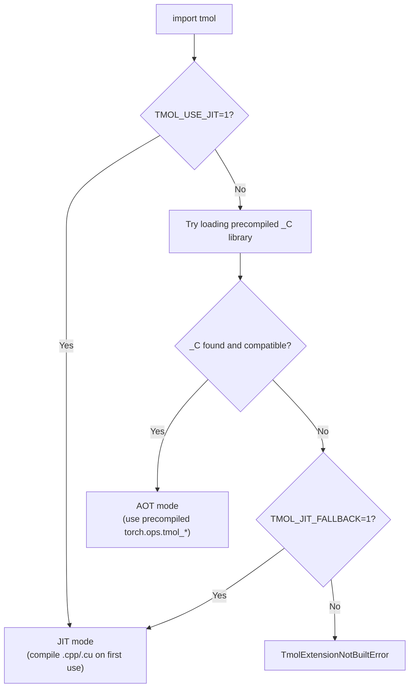

# Tmol

`tmol` (TensorMol) is a GPU-accelerated reimplementation of the Rosetta molecular modeling energy function (`beta_nov2016_cart`) in PyTorch with custom C++/CUDA kernels. It computes energies and derivatives for protein structures and supports gradient-based minimization, enabling ML models to incorporate biophysical scoring during training or to refine predicted structures with Rosetta's experimentally validated energy function.

Full documentation: [tmol Wiki](https://github.com/uw-ipd/tmol/wiki/DevHome)

## Table of Contents

- [Installation](#installation)
- [Extension Loading: AOT vs JIT](#extension-loading-aot-vs-jit)
- [Containers](#containers)
- [Usage](#usage)
- [Integrations](#integrations)
- [CI Strategy](#ci-strategy)
- [Development Workflow](#development-workflow)
- [Citation](#citation)

## Installation

### Pre-built wheels (recommended)

Pre-built wheels ship with **ahead-of-time (AOT) compiled** C++/CUDA extensions -- no `nvcc` or CUDA toolkit needed at install time.

Wheels are available for Linux x86_64. Pick the one matching your **PyTorch version** and **CXX11 ABI**:

<details>
<summary><b>Which ABI do I have?</b></summary>

```bash
python -c "import torch; print('CXX11 ABI:', torch._C._GLIBCXX_USE_CXX11_ABI)"
```

| Result  | Typical source                           | Wheel suffix        |
|---------|------------------------------------------|---------------------|
| `True`  | NGC container, conda, source-built torch | `cxx11abiTRUE`      |
| `False` | `pip install torch` on bare metal        | `cxx11abiFALSE`     |

The ABI must match because C++ extensions are linked against PyTorch's C++ standard library. A mismatch causes segfaults or missing-symbol errors. See [flash-attention#457](https://github.com/Dao-AILab/flash-attention/issues/457) for more background.

</details>

| PyTorch | CUDA | ABI   | Wheel tag                              |
|---------|------|-------|----------------------------------------|
| 2.5     | 12.6 | TRUE  | `+cu126torch2.5cxx11abiTRUE`          |
| 2.5     | 12.4 | FALSE | `+cu124torch2.5cxx11abiFALSE`         |
| 2.8     | 12.9 | TRUE  | `+cu129torch2.8cxx11abiTRUE`          |
| 2.8     | 12.6 | FALSE | `+cu126torch2.8cxx11abiFALSE`         |
| 2.10    | 13.1 | TRUE  | `+cu131torch2.10cxx11abiTRUE`         |
| 2.10    | 12.6 | FALSE | `+cu126torch2.10cxx11abiFALSE`        |

> [!TIP]
> CUDA wheels are **forward-compatible** within a major version: a `cu124` wheel works on any CUDA 12.x driver >= 12.4. You do not need an exact CUDA version match.

Check your environment:

```bash
python -c "import torch; print(f'PyTorch: {torch.__version__}, CUDA: {torch.version.cuda}, ABI: {torch._C._GLIBCXX_USE_CXX11_ABI}')"
```

Install from [GitHub Releases](https://github.com/uw-ipd/tmol/releases):

```bash
# Direct URL (replace RELEASE_TAG and WHEEL_FILENAME):
pip install https://github.com/uw-ipd/tmol/releases/download/RELEASE_TAG/WHEEL_FILENAME.whl

# Or use --find-links to let pip resolve by version:
pip install tmol --find-links https://github.com/uw-ipd/tmol/releases/download/RELEASE_TAG/
```

### From PyPI (source distribution)

The source distribution on PyPI compiles C++/CUDA extensions during installation.
This requires `nvcc` (CUDA toolkit) and a C++17-capable compiler.

```bash
pip install tmol              # requires nvcc for kernel compilation
pip install tmol[dev]         # includes development tools (ruff, pytest, etc.)
```

### From source (development)

```bash
git clone https://github.com/uw-ipd/tmol.git && cd tmol
pip install -e ".[dev]"

# Build C++/CUDA extensions in-place
python setup.py build_ext --inplace
```

## Extension Loading: AOT vs JIT

tmol's C++/CUDA kernels can be loaded in two ways:

- **AOT (Ahead-Of-Time)**: Pre-compiled `.so` libraries are bundled inside the installed package (e.g., from a wheel). Operations are registered in `torch.ops.tmol_*` namespaces. This is the default and requires no compiler at runtime.

- **JIT (Just-In-Time)**: Source files (`.cpp`, `.cu`) are compiled on first use via `torch.utils.cpp_extension.load()`. This requires `nvcc` and a C++ compiler to be available. Useful for kernel development where you want to edit and reload C++/CUDA code without rebuilding the whole package.

Two environment variables control which path is taken:

| Variable           | Effect                                                                 |
|--------------------|------------------------------------------------------------------------|
| `TMOL_USE_JIT=1`   | **Force JIT mode.** Skip AOT entirely; always compile from source.     |
| `TMOL_JIT_FALLBACK=1` | **Fallback to JIT** if the precompiled `_C` library is missing or incompatible. Silent degradation instead of an error. |

When neither variable is set, tmol tries to load the precompiled library and raises an error if it is not found.



**Typical scenarios:**

| User                          | Install method     | Env vars needed | Mode |
|-------------------------------|--------------------|-----------------|------|
| End user                      | Pre-built wheel    | None            | AOT  |
| End user                      | `pip install tmol` (sdist) | None   | AOT (compiled at install time) |
| Kernel developer              | `pip install -e .` | `TMOL_USE_JIT=1` | JIT |
| CI without GPU                | Pre-built wheel    | None            | AOT  |

### CUDA toolkit for JIT mode

JIT mode requires `nvcc` and CUDA headers. You can either:

1. **Use a CUDA-enabled container** (NGC, conda) or set `CUDA_HOME` to point to your system CUDA toolkit.
2. **Install the pip CUDA extra**, which downloads `nvcc` and runtime libraries:

```bash
pip install .[cuda]
```

The pip CUDA extra auto-detects `nvcc` and configures `CUDA_HOME`, `PATH`, and `LD_LIBRARY_PATH`, including compatibility symlinks needed by PyTorch (e.g., `nvidia/cu12 -> nvidia/cu13`).

## Containers

The container definitions install all dependencies into an NVIDIA NGC PyTorch base image that already provides `torch`, `numpy`, `nvcc`, and CUDA libraries. Bind-mount your tmol checkout at runtime.

**Docker:**

```bash
docker build -t tmol-dev -f containers/docker/tmol-dev.Dockerfile .
docker run --gpus all -it -v $(pwd):/tmol_host -w /tmol_host tmol-dev bash
pip install -e .  # inside container
```

**Apptainer:**

```bash
apptainer build tmol-dev.sif containers/apptainer/tmol-dev.def
apptainer run --nv --bind $(pwd):/tmol_host tmol-dev.sif
```

## Usage

### Quick start

```python
import tmol

# Load a structure
pose_stack = tmol.pose_stack_from_pdb("1ubq.pdb")

# Score it
sfxn = tmol.beta2016_score_function(pose_stack.device)
scorer = sfxn.render_whole_pose_scoring_module(pose_stack)
print(scorer(pose_stack.coords))
```

### Minimization

```python
cart_sfxn_network = tmol.cart_sfxn_network(sfxn, pose_stack)
optimizer = tmol.lbfgs_armijo(cart_sfxn_network.parameters())

def closure():
    optimizer.zero_grad()
    E = cart_sfxn_network().sum()
    E.backward()
    return E

optimizer.step(closure)
```

### Save output

```python
tmol.write_pose_stack_pdb(pose_stack, "output.pdb")
```

### Verify installation

```python
import tmol
print(f"tmol {tmol.__version__} loaded successfully")
```

## Integrations

### RosettaFold2

Install tmol into your RF2 environment:

```bash
cd <tmol repo root>
pip install -e .
```

```python
# RF2 -> tmol
seq, xyz, chainlens = rosettafold2_model.infer(sequence)
pose_stack = tmol.pose_stack_from_rosettafold2(seq[0], xyz[0], chainlens[0])

# tmol -> RF2
xyz = tmol.pose_stack_to_rosettafold2(...)
```

> [!NOTE]
> Tested on Ubuntu 20.04. Other platforms should work but are not yet verified.

> [!NOTE]
> Hydrogens and OXT coordinates from terminal residues are not preserved across the RF2/tmol interface.

> [!WARNING]
> Call `torch.set_grad_enabled(True)` before using the tmol minimizer, since RF2 disables gradients during inference by default.

### OpenFold

```python
output = openfold_model.infer(sequences)
pose_stack = tmol.pose_stack_from_openfold(output)
```

## CI Strategy

tmol uses a hybrid CI setup:

| System              | Purpose                                                                 |
|---------------------|-------------------------------------------------------------------------|
| **Buildkite**       | GPU runners for CUDA-heavy tests and benchmarks                         |
| **GitHub Actions**  | Wheel matrix builds, sdist builds, publishing to TestPyPI/GitHub Releases |

The Buildkite pipeline definition lives in `.buildkite/pipeline.yml`. To enable it on a branch, connect the pipeline in the Buildkite UI and configure the GitHub webhook for the desired branches/PRs.

## Development Workflow

tmol uses [Test-Driven Development](https://github.com/uw-ipd/tmol/wiki/Testing#writing-tests). Write tests first, then implement.

### Building extensions locally

```bash
# Build all extensions (production + test)
python setup.py build_ext --inplace

# Skip test extensions (faster builds)
TMOL_SKIP_TEST_EXTS=TRUE python setup.py build_ext --inplace

# Target specific GPU architectures (default: "8.0 8.6 8.9 9.0 10.0+PTX")
TORCH_CUDA_ARCH_LIST="8.0 9.0+PTX" python setup.py build_ext --inplace
```

### Pre-commit hooks

tmol uses pre-commit hooks for `clang-format` (C++) and `ruff` (Python). If formatting changes are needed, the first commit attempt will fail and the tools will reformat your code. Run `git diff` to review, then `git add` and commit again.

```bash
pip install -e ".[dev]"
pre-commit install
```

### Pull requests

All changes to master go through pull requests. PRs are merged via squash or rebase to keep a linear history. Each PR should be an atomic unit of work. If a PR grows too large, split it into stacked PRs.

### Running tests

```bash
pytest tmol/tests/ -v
```

## Citation

If you use tmol in your work, please cite:

> Andrew Leaver-Fay, Jeff Flatten, Alex Ford, Joseph Kleinhenz, Henry Solberg, David Baker, Andrew M. Watkins, Brian Kuhlman, Frank DiMaio, *tmol: a GPU-accelerated, PyTorch implementation of Rosetta's relax protocol*, (manuscript in preparation)
