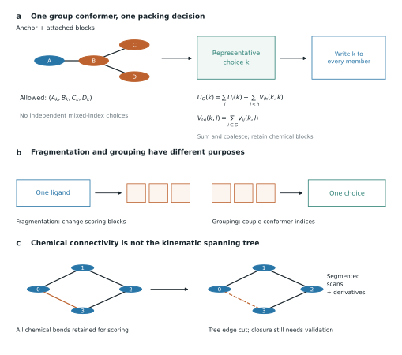

.. _chemistry-workflows:

Scoring, packing and relaxing prepared chemistry
================================================

These examples target the feature commit identified in
:ref:`noncanonical-chemistry`. Install that branch with its ``ligand`` extra
in a supported tmol environment. CPU scoring is useful for small examples;
large group-packing problems can require CUDA. The examples are supplied as
source-checked recipes; the documentation build does not execute molecular
modeling or establish numerical benchmark results.

Prepare and score
-----------------

Use the same extended database for construction, scoring and sampling:

.. code-block:: python

   import torch
   from tmol.io import pose_stack_from_cif
   from tmol.score import beta2016_score_function

   device = torch.device("cuda" if torch.cuda.is_available() else "cpu")
   pose, context = pose_stack_from_cif(
       "complex.cif",
       device,
       prepare_ligands=True,
       strict_ligands=True,
       ligand_seed=20250828,
       return_context=True,
   )
   param_db = context.parameter_database
   sfxn = beta2016_score_function(device, param_db=param_db)
   scorer = sfxn.render_whole_pose_scoring_module(pose)
   xyz = pose.coords.detach().clone().requires_grad_(True)
   energy = scorer(xyz)
   gradient, = torch.autograd.grad(energy.sum(), xyz)
   if not torch.isfinite(energy).all() or not torch.isfinite(gradient).all():
       raise RuntimeError("Non-finite energy or coordinate gradient")

The keyword is ``prepare_ligands``, not ``process_ligands``. The latter spelling
in the PR description is not the preparation flag in this commit. The build
context's database attribute is ``parameter_database``, not ``param_db``.
For an existing bonded AtomArray, use ``pose_stack_from_biotite`` with the same
preparation options. Reuse the rendered scorer for changing coordinates with
fixed layout; construct a new scorer after packing changes the layout.
See `CIF reader`_, `Biotite construction`_, and `Build context`_.

Cartesian minimization
----------------------

.. code-block:: python

   from tmol.optimization import run_cart_min

   minimized = run_cart_min(pose, sfxn, verbose=False)
   final_scorer = sfxn.render_whole_pose_scoring_module(minimized)
   print(final_scorer(minimized.coords))

Minimization adjusts coordinates continuously. It does not search all ligand
poses, sample chemical reactions, enumerate protonation states, or certify
geometric quality. Retain and inspect all atoms, covalent bonds, stereocenters
and any missing-coordinate reconstruction.

.. _group-packing:

Configure sampling explicitly
-----------------------------

The packer chooses among conformers supplied by samplers. ``PackerPalette``
alone supplies a fallback that carries the input conformation for otherwise
uncovered blocks. For broad repacking, add amino-acid and nucleic-acid
samplers, then enable joint sampling of covalent groups:

.. code-block:: python

   from tmol.pack import PackerPalette, PackerTask, pack_rotamers
   from tmol.pack.rotamer import (
       FixedAAChiSampler, IncludeCurrentSampler, NaChiRotamerSampler,
   )
   from tmol.pack.rotamer.dunbrack import create_dunbrack_sampler_from_database
   from tmol.pack.rotamer._conjugated_groups import add_conjugated_group_sampler

   def configure_repacking(task):
       task.restrict_to_repacking()
       task.add_conformer_sampler(
           create_dunbrack_sampler_from_database(param_db, device)
       )
       task.add_conformer_sampler(FixedAAChiSampler())
       task.add_conformer_sampler(NaChiRotamerSampler.from_database(param_db, device))
       task.add_conformer_sampler(IncludeCurrentSampler())
       # Uses the fixed chemical connectivity of this repacking task.
       # Add last so it can disable independent movement of group anchors.
       add_conjugated_group_sampler(task, pose)

   task = PackerTask(pose, PackerPalette())
   configure_repacking(task)
   packed = pack_rotamers(pose, sfxn, task, verbose=False)

``add_conjugated_group_sampler`` is currently an internal import on the feature
branch. It discovers an anchor plus attached blocks, builds conformers using
one group kinematic forest, and disables samplers that would move the anchor
independently. Each member's rotamer index then means the same group conformer.
Scoring removes incompatible within-group index combinations; the interaction
graph collapses the group to one representative choice and writes the selected
coordinates back to every member. See `Group discovery`_, `Group packing`_
and `Group sampler`_.

   Group packing couples choices while preserving block-level scoring.
   User-defined fragmentation is a separate operation on the representation.

A free ligand is not claimed by the conjugated-group sampler. The default
amino-acid and nucleic-acid samplers also do not provide general free-ligand
heavy-atom conformer search. Such a ligand may remain in its input conformer
during packing and subsequently move under Cartesian minimization. Supply an
appropriate conformer sampler when a free-ligand conformational search is
required.

Borrowed distributions and budgets
----------------------------------

``dunbrack_reference`` lets a noncanonical amino acid borrow candidate torsions
from a structurally compatible canonical sidechain. Remaining heavy torsions
can be enumerated from ``chi_samples``. This is a sampling proposal: the
Dunbrack energy term resolves its own library by the residue's base name and
does not automatically score the borrowed canonical probability. For modified
nucleotides, ``na_base_reference`` can participate in both scoring and
sampling. Their sampler holds the input sugar pucker fixed while sampling
glycosidic chi and supported proton torsions. See `Dunbrack sampler`_,
`Dunbrack scoring`_ and `NA sampler`_.

The group and NA samplers have ``chi_sample_expanded_limit`` and
``chi_sample_limit`` settings, defaulting to 100 and 1000. The budget removes
extra-angle expansions, then freezes heavy chi from the tips of the relevant
kinematic tree inward. Group budgeting accounts for the number of blocks and
uses an estimate of the anchor-library contribution. Proton chi are not frozen.
These are sampling-budget heuristics, not a universal hard bound on final
rotamer count or GPU memory; the current group conformer is also offered when
measurable. See `Chi budget`_.

At the audited commit, ``PackerTask.set_chi_sample_budget`` stores values that
are not propagated by ``SetPackerTask.from_packer_task``. For a custom group
budget, construct the sampler with its settings before its first use:

.. code-block:: python

   from tmol.pack.rotamer._conjugated_chi_sampler import ConjugatedChiSampler

   # Alternative group-sampler construction inside a task configuration.
   # Use this instead of adding the default group sampler a second time.
   library = create_dunbrack_sampler_from_database(param_db, device)
   group_sampler = ConjugatedChiSampler(
       library_sampler=library,
       chi_sample_expanded_limit=100,
       chi_sample_limit=1000,
   )
   # After adding the other samplers to a fresh task:
   # add_conjugated_group_sampler(task, pose, sampler=group_sampler)

Inspect actual generated counts and test budget changes on the intended system.
Changing a setting after block annotations have been cached can leave old
sampling data in use.

FastRelax with the same sampling choices
----------------------------------------

Pass the explicit task configuration through every pack/minimize cycle:

.. code-block:: python

   from tmol.kinematics import CartesianMoveMap, FoldForest
   from tmol.relax import fast_relax

   relaxed = fast_relax(
       pose,
       sfxn,
       PackerPalette(),
       CartesianMoveMap(),
       FoldForest.reasonable_fold_forest(pose),
       task_operations=[configure_repacking],
       num_repeats=2,
       verbose=False,
   )

This uses the default Cartesian minimizer. The example restricts to repacking,
so using the original pose's fixed connectivity to configure groups remains
appropriate. A design task that changes identities or attachment topology
needs its own lifecycle handling. FastRelax's default task operation installs
amino-acid samplers and a current conformer; it does not install the NA or
conjugated-group samplers. A successful default call therefore does not mean
all these classes were sampled. See `FastRelax`_.

Chemical edges in ``FoldForest`` propagate motion across non-polymeric covalent
bonds. A cycle is cut in the spanning forest while its chemical bond remains
in the pose's scoring topology. This is not an analytical ring-closure solver;
especially for internal-coordinate minimization, inspect closure geometry and
choose appropriate constraints or a validated closure protocol.

.. include:: _source_links.inc
