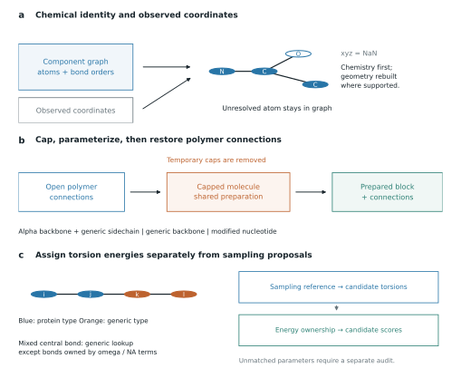

.. _noncanonical-chemistry:

Generalized chemistry from mmCIF
================================

The feature branch in `PR 503`_ extends the ligand preparation machinery to
noncanonical amino acids, modified nucleic acids, peptide-like backbones, and
covalently attached ligands and glycan trees. These components become ordinary
blocks in a ``PoseStack`` and can participate in scoring, appropriately
configured packing, and Cartesian relaxation. The contribution is a common
construction and execution path across chemistry; it is not a claim that every
deposited component has an accurate parameterization.

This guide describes commit ``c03c1e745f3bc655948ea12dac44d6c74620358f`` on
``dimaio/noncanonicals_through_ligand_pipeline``. PR 503 was open at the time of
the audit. A release number alone does not identify this feature state.
See :ref:`chemistry-workflows` for code and :ref:`rosetta-comparison` for the
relationship to Rosetta.

   Chemical identity, coordinate availability, and scoring-term ownership are
   separate decisions. The drawing is an implementation schematic, not a
   measured coverage result.

Chemical identity is more than the observed atoms
-------------------------------------------------

An unresolved sidechain atom is still part of a residue. Parameterizing only
the resolved atoms can accidentally turn a missing sidechain tip into a
different, protonated molecule. ``atom_array_from_cif`` combines observed
``atom_site`` coordinates with component definitions from ``chem_comp_atom``
and ``chem_comp_bond``, with a component-dictionary fallback when enabled.
Declared but unresolved atoms enter the array at NaN, allowing preparation to
recognize the complete chemistry and construction to rebuild supported missing
coordinates. Atoms lost through polymerization are distinguished from atoms
missing through unresolved density. See `CIF reader`_.

This also accommodates bonded AtomWorks-style arrays that already mark missing
atoms with NaN. Use ``pose_stack_from_biotite`` for such arrays; do not assume
that every function whose name contains AtomWorks invokes chemical preparation.
Unknown incomplete chemistry without a usable definition can still fail.
If no definition describes an input at all, the reader can warn and treat the
observed atom set as complete; that warning needs inspection in a corpus audit.

Prefer mmCIF for generalized preparation of PDB-deposited structures. A PDB
accession and the legacy ``.pdb`` text format are different things: coordinate
records alone do not provide reliable ligand bond orders. ``pose_stack_from_pdb``
uses the default chemical vocabulary and is not an equivalent automatic
noncanonical-preparation entry point. Custom component codes can collide with
the component dictionary; use ``use_ccd=False`` when their chemistry is defined
locally and their names must not trigger dictionary lookup.

Polymer residues use the ligand machinery without losing connections
--------------------------------------------------------------------

Preparation uses the bond graph, attachment sites, polymer-entity annotations,
and declared component type to distinguish chain members from free molecules
and sidechain conjugates. A supported polymer profile supplies its mainchain,
connection atoms, and temporary chemical caps. The capped molecule passes
through protonation, conformer generation, atom typing and charge assignment;
the caps are then removed and the polymer connections and internal-coordinate
records restored. Nonstandard backbones receive generated terminus patches
and associated charge records. Canonical backbone aliases preserve supported
input spellings. See `Polymer preparation`_ and `Polymer profiles`_.

An unmodified alpha-amino-acid backbone can retain protein backbone types while
its modified sidechain uses generic ligand types. A proline-like ring on the
amide nitrogen is distinguished from N-methylation or a peptoid substituent.
Beta-amino acids, gamma-linked peptides and other recognized nonstandard
backbones use generic typing with explicit polymer connectivity. They are not
forced into alpha-amino-acid statistical models merely because they are in a
peptide chain. Modified RNA/DNA bases may use an explicit ``na_base_reference``;
a fused dinucleotide can instead follow a generic path. See `Polymer builder`_
and `Nucleic acid tests`_.

Covalent attachments modify both sides of a connection
------------------------------------------------------

A conjugated ligand or glycan is not just placed near its anchor. Preparation
creates named conjugation connections and variants, adjusts hydrogens, atom
typing and charges, and transfers explicit covalent links into the canonical
form and ``PoseStack``. Canonical anchors can acquire connection patches while
retaining their other residue information. Tests cover lysine-biotin, an
O-linked glycan and a branched N-linked glycan, including charge bookkeeping
and connections on both partners. See `Conjugation preparation`_ and
`Covalent component tests`_.

Connected blocks remain separate scoring blocks. For packing, their selected
conformations can be coupled as one group; see :ref:`group-packing`.
Preparing the connections does not by itself install a group sampler in the
packer or in FastRelax.

Input routes and persistence
----------------------------

``pose_stack_from_cif(..., prepare_ligands=True, return_context=True)`` returns
a pose and a ``PoseBuildContext`` holding the extended parameter database,
canonical ordering, residue-type set and packed block types. Use
``context.parameter_database`` for the score function and library samplers.
Reusing a compatible context avoids repeating chemical setup; rerender scoring
modules when the pose layout or topology changes.

The low-level ``prepare_ligand_from_smiles`` and
``prepare_ligand_from_mol2`` entry points still create free ligands, not
polymer-aware residues. MOL2 with authoritative charges can bypass conformer
generation. Derived-SMILES preparation uses Dimorphite-DL protonation, RDKit
distance geometry, and OpenBabel charge assignment; install the ``ligand``
extra for this path, including CIF inputs that route through it.
MMFF94 is the intended charge model, but the implementation can warn and use
another charge model if MMFF94 cannot parameterize the molecule. Some
non-tetrahedral stereochemical descriptors are also stripped with a warning
for OpenBabel compatibility. Preserve these warnings and inspect the resulting
chemistry. See `Charge preparation`_.

Prepared definitions can be saved with ``params_output`` and reloaded through
``ligand_params_files``. The ``.tmol`` format carries prepared chemical and
scoring records and supports inspection and manual correction. It should be
archived with the source structure, preparation seed, pH, environment and
commit. Reusing a prepared definition is not evidence that the original
parameterization was accurate.

Scope and failure interpretation
--------------------------------

.. list-table:: Different meanings of support
   :header-rows: 1
   :widths: 23 44 33

   * - Chemistry
     - Implemented route
     - Boundary
   * - Noncanonical amino acids
     - Profile-based polymer preparation; shared score and rotamer machinery
     - Backbone must be identifiable; rotamers are approximations
   * - Modified RNA/DNA
     - Polymer/base references and nucleic-acid scoring/sampling
     - Base similarity is not a fitted potential for every modification
   * - Native D residues and cyclic peptides
     - Mirrored definitions/tables and chemical closure connections
     - Closure in a chemical graph is not an exact loop-closure solver
   * - Covalent ligand or glycan attachment
     - Connections, variants and explicit joint group packing
     - Configure the group sampler; inspect non-tree links
   * - Free non-polymer ligands
     - Preparation, scoring and Cartesian minimization
     - Default samplers need not explore heavy-atom conformations
   * - Metal-containing unknown components
     - Automatic preparation rejects them
     - No blanket metal-site claim follows from this pipeline

``strict_ligands=True`` raises ``LigandPreparationError`` for detected
unpreparable components; lenient mode can warn and drop them. Strict
preparation is not a universal force-field-coverage check: generic torsions
with no matching parameters can be omitted, and preparation can use the
documented charge or geometry fallbacks. Inspect atom retention, connectivity,
parameter coverage, nonzero term contributions, finite gradients and geometric
quality separately. ``strict_atom_types`` concerns atom-type mappings and does
not close all these gaps. See `Preparation boundary`_ and `Generic torsions`_.

Keep construction success, actual conformational sampling, numerical
correctness and scientific accuracy as separate outcomes. A static ligand
carried through a packing run has not thereby been conformationally packed.
The implementation tests are useful regression evidence; they do not provide
a PDB-wide success fraction or establish superiority to Rosetta on all these
chemistries.

.. include:: _source_links.inc
