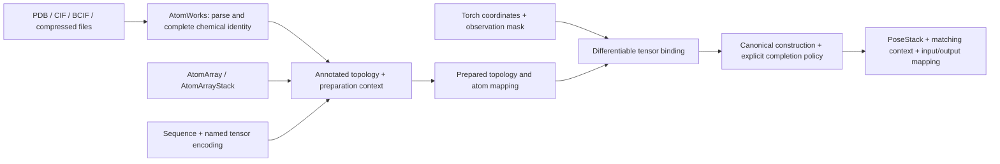

# One input contract for files, structure metadata and tensors

## Recommendation

Adopt the proposed two-front-end design: AtomWorks owns file parsing and generic
chemical completion; a Torch tensor mapper binds coordinates to prepared topology.
Both feed one tmol construction and completion pipeline. Remove model-named entry points and document application-owned extraction examples. PR #380 should
become a small backbone4 adapter plus shared completion tests, rather than a new
construction pipeline.

This is a design recommendation. The explicit AtomWorks CIF reader and the
complex-input fixes are implemented on the review branch; the generic prepared-topology API remains proposed. The OpenFold/RF2 interfaces and
ordering factories are removed, with executable examples in `docs/model_inputs.rst`.

AtomWorks already supplies reusable `TokenEncoding` definitions and conversions.
Its `atom_array_to_encoding()` initializes coordinate slots with NaN by default;
`atom_array_from_encoding()` retains chemically present atoms with NaN
coordinates and stores the observation mask as occupancy. These helpers do not
generally impute finite missing coordinates. The latter converts tensors through
CPU NumPy, so reuse its encoding tables and identity rules to prepare the Torch
mapping rather than routing guidance coordinates through that conversion on
every call. Tmol's existing atom37/Biotite overlay separately replaces nonfinite
tensor entries with finite reference coordinates; that fallback needs an
explicit policy, and those reference values do not depend on the missing input
tensor slots.

## Revisions inspected

- Frank #503 head `0593a93b07d80b0302383163d2d98c78e315ab98` and the review branch at `01159dd7a`.
- Current master `c8dfab919`, inspected in the isolated `tmol-input-contract-audit` worktree.
- #380 head `513609e6d644d1889def2cf082d3b8d9d7a10386`, one implementation commit above `853235fa6`; current master has 36 commits after that common base.
- Local differentiable AtomWorks worktree `9d50bacfd`; its metadata/tensor overlay design is already represented on current master.
- The supplied working directory, RFProteina-dev-main, is on `perf/cueq-apb-honest-benchmark` with an existing conflicted merge. Its dependency source still names tmol 0.1.42 and its metrics use older module imports. It was inspected without modification.
- RFProteina-tmol-guidance-v0153 already uses `pose_stack_from_atom37_and_biotite` and prepares `prepare_pose_stack_from_atom37` when available. This is the relevant existing fast guidance integration.
- The sibling `projects/tmol` checkout is also conflicted and was not modified.

## What the entry points actually do

| Input route | Identity/topology source | Coordinates / batching | Completion and limitations |
|---|---|---|---|
| `pose_stack_from_pdb` | Native PDB parser plus default canonical database | File/text; CPU parsing | Calls canonical construction directly; no general ligand-preparation stage or shared sidechain-completion policy. |
| #503 `pose_stack_from_cif` | CIF declarations, optional CCD, explicit bonds/entities | File; selected model | Biotite path with optional general preparation. Review adds `reader="atomworks"`; both readers now carry parsed component types without rereading the file. |
| `pose_stack_from_biotite` | Annotated AtomArray/Stack and matching preparation context | NumPy coordinates; stacking assumes shared topology | General chemistry and sidechain rebuilding. Pure AtomArray conversion does not preserve an upstream Torch autograd tape. |
| `pose_stack_from_atomworks` | Hard-coded protein token/atom37 tables and protein-only database subset | Torch `[B,L,37,3]` | Despite its name, this is not the full AtomWorks chemistry input. It accepts protein tokens 1–20 and calls canonical construction directly. |
| Current master `pose_stack_from_atom37_and_biotite` | AtomArray metadata plus context; `token_id` / `atom37_slot` routing | Torch `[B,T,37,3]`, including atomized non-protein tokens | Reuses Biotite construction and restores finite input coordinates after packing. Chemistry is not limited to the protein token table. This route is absent from Frank's current branch. |
| Current master `prepare_pose_stack_from_atom37` | Same topology/mapping prepared once | Repeated tensor batches through a callable | Reuses static mapping/topology and context for guidance. This is the natural basis for the unified prepared builder. |
| `pose_stack_from_openfold` | OpenFold sequence IDs and residue-dependent atom14 names | `positions[-1]`, batched | Extracts model fields and maps to canonical form, then constructs directly. Model extraction belongs in a shim. |
| `pose_stack_from_rosettafold2` | RF2 sequence IDs, atom names, chain lengths | One pose; its larger layout includes hydrogens | Has terminal-H suppression semantics. Replacing it by heavy-only atom14 without a policy would discard supplied atoms. |
| #380 backbone adapter | Sequence order plus N/CA/C/O | Torch `[B,L,4,3]` or unbatched | Adds explicit pack/none, packing setup, post-packing reconstruction and coordinate restoration. Most orchestration belongs in the shared construction layer. |
| `pose_stack_from_canonical_form` | Integer indices tied to a particular CanonicalOrdering/database | Torch canonical tensors | Remains the low-level construction boundary. Canonical integer arrays are not self-describing chemistry and cannot be migrated between orderings silently. |

## Checked behavior, not just API names

The CPU probe in `results/input-encoding-contract.json` confirms that the
existing master Biotite-plus-atom37 canonical path can carry a bare N/CA/C/O
tensor with bit-identical mapped coordinates and exactly unit gradients for a
coordinate-sum check. No PDB write/read is required. The pure AtomArray route
has no Torch tape. This probe checks mapping, not end-to-end packing.

Standard protein atom37 slot names **agree** between AtomWorks and AlphaFold in
the inspected tables; their residue-token IDs differ (AtomWorks starts at 1,
AF2 at 0). Atom14 has a different, residue-dependent slot layout: ALA O is at
slot 3 in OpenFold atom14 and slot 4 in atom37. RF2 also supplies hydrogen
slots. The encoding therefore includes both residue-token order and atom names,
not just the tensor's last dimensions.

The current tensor overlay treats a non-finite tensor coordinate as “retain the
reference AtomArray coordinate.” It does not mean “this atom is missing.” That
is tested existing behavior and must become an explicit policy in a unified API.

## Proposed common contract



1. **Separate chemical identity from coordinate availability.** A NaN atom remains
   part of its residue. Use distinct residue-padding and atom-observation masks.
   Zero is a valid coordinate. Reject infinity and partially finite triplets,
   or normalize a documented missing sentinel before construction.
2. **Use a general atom mapping in the core.** Accept `[B,T,K,3]` with a named
   encoding or explicit mapping. Provide atom14, atom37 and backbone4 presets.
   An AtomArray supplies arbitrary ligand/PTM/NA topology; pure tensor callers
   supply sequence, encoding, chain/connectivity metadata and the context.
   Avoid expanding atom14/backbone4/atomized input into a temporary atom37 array.
3. **Prepare once, bind repeatedly.** Chemical preparation, identity validation,
   residue/atom lookup and topology planning happen when creating a builder.
   Coordinate binding stays in Torch on the requested device. Heterogeneous
   chemistry batches are grouped by topology/context, as the RFD4 guidance
   integration already does, rather than silently sharing one incompatible map.
4. **Make completion independent of the input format.** Distinguish rejecting
   missing atoms, leaving an explicitly incomplete intermediate, and packing
   missing sidechains. Hydrogen rebuilding and hydrogen optimization are
   separate choices. Returning a diagnostic mask must not implicitly disable
   validation or change the scientific operation.
5. **Define the gradient promise precisely.** Finite supplied coordinates are
   preserved and retain their autograd connection. Discrete packing and chemical
   parameter generation are not differentiable. Restoring input atoms after
   packing does not differentiate through the chosen rotamers.
6. **Make authority explicit.** A tensor can be authoritative for mapped atoms,
   with reference fallback a separate option. AtomWorks parsing must declare its
   model, altloc, assembly, water, identifier and CCD policies. Keep author and
   label identifiers available even when canonical fields use one convention.
7. **Keep one chemical context.** Return/reuse the exact ParameterDatabase,
   CanonicalOrdering and PackedBlockTypes used to build the pose. Serialized
   canonical tensors need an ordering/chemistry identifier. The existing
   model-specific ordering helpers should remain available to read old data.

Illustrative API shape (proposal, not implemented):

```python
parsed = read_structure(path, parser_config=...)  # AtomWorks
builder = prepare_pose_stack(parsed.atom_array, preparation=..., mapping=...)
pose = builder(coords, observed=mask, sidechains="error", hydrogens="build")

# Sequence-only tensors use the same builder after making topology/mapping:
builder = prepare_pose_stack(sequence=sequence, chains=chains,
                             encoding="alphafold_atom14", preparation=...)
```

## What to do with #380

Keep the useful capability and tests; reduce its implementation. The public
backbone convenience function can be a thin wrapper over a backbone4 encoding
and the common completion policy. Do not add another score-function/sampler
cache or another post-packing reconstruction path.

Anchored review comments for its current head:

- [Lines 95–164](https://github.com/uw-ipd/tmol/blob/513609e6d644d1889def2cf082d3b8d9d7a10386/tmol/io/_pose_stack_from_backbone_coords.py#L95): move construction, packing, missing-leaf completion and input-coordinate restoration into the shared builder, then call it from tensor and AtomArray routes. The HA failure is format-independent; the #503 follow-up now fixes missing-ancestor visibility and a fixed-axis backup in the shared leaf builder.
- [Lines 193–210](https://github.com/uw-ipd/tmol/blob/513609e6d644d1889def2cf082d3b8d9d7a10386/tmol/io/_pose_stack_from_backbone_coords.py#L193): retain the efficient four-slot mapping without allocating a 37-slot intermediate; make it an encoding preset shared with other tensor adapters.
- [Lines 199–206](https://github.com/uw-ipd/tmol/blob/513609e6d644d1889def2cf082d3b8d9d7a10386/tmol/io/_pose_stack_from_backbone_coords.py#L199): the documented padding token is -1, but every negative integer, including -2, is accepted. Validate the exact sentinel and integer input dtype before conversion; the CPU probe reproduces the negative-token acceptance.
- [Lines 234–238](https://github.com/uw-ipd/tmol/blob/513609e6d644d1889def2cf082d3b8d9d7a10386/tmol/io/_pose_stack_from_backbone_coords.py#L234): the docstring says non-finite entries mark absence, but the canonical conversion copies infinity unchanged. Reject it or normalize the explicit observation mask; the probe reproduces this discrepancy.
- [Lines 80–86 of the tests](https://github.com/uw-ipd/tmol/blob/513609e6d644d1889def2cf082d3b8d9d7a10386/tmol/tests/io/test_pose_stack_from_backbone_coords.py#L80): keep the token-order validation tests, then add cross-encoding equivalence, reference-fallback policy, masked padding and multiple-topology batch tests to the common suite.

These comments are review drafts; none were posted to #380.

## AtomWorks dependency decision and migration

AtomWorks is the right owner for shared file input. The review branch now makes
it a core dependency, pinned to the companion [AtomWorks PR #349](https://github.com/baker-laboratory/atomworks-dev/pull/349),
and provides `pose_stack_from_cif(..., reader="atomworks")`. It uses the current
ParseConfig API, shares protonation/repair/conversion/authored-CCD code, preserves
observed HIS protons, and rejects deletion of source heavy-atom names. The empty
`tmol[atomworks]` extra remains for compatibility. The earlier optional released
version matrix is historical; a release containing the companion APIs must
replace the temporary authenticated Git pin before public package publication.

The native reader currently remains for strict `use_ccd=False` and its author-ID
contract. The explicit reader selection is a migration step, not the final proposed split.
To make AtomWorks the only file parser, first put the necessary authority,
identifier and omission checks in a released shared parser contract, then port
existing PDB/CIF compatibility tests, switch the file entry points, and delete
the redundant native completion implementation. Do not move tmol's force-field
parameter generation or discrete sampling into the parser.

The user explicitly requested full removal of OpenFold/RF2 interfaces and their
model-specific factories. `docs/model_inputs.rst` shows application-owned extraction
and a named-tensor mapping to the existing canonical construction boundary. It
includes explicit preservation/rebuilding of RF2 hydrogens. Old canonical tensors
require their original ordering for migration; the tutorial does not claim that
old integer tensors can be loaded under today's default database.
