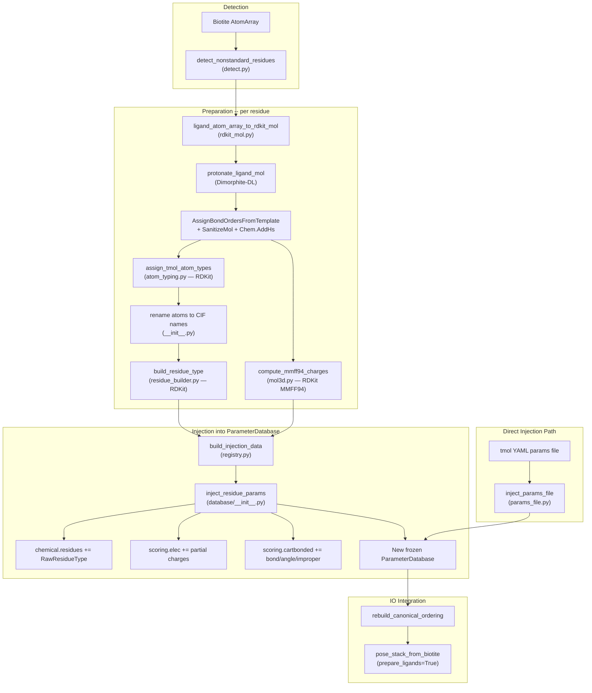

# Ligand Preparation Pipeline

Detects non-standard residues in Biotite AtomArrays, builds protonated
3D molecules with partial charges, assigns Rosetta-compatible atom types,
and returns a new `ParameterDatabase` with the residue data injected.

## Pipeline Overview



## Database Design

| Step | Library | Why |
|------|---------|-----|
| Mol construction from AtomArray | **RDKit** + Biotite | Direct coordinate + bond transfer, no SMILES roundtrip |
| Protonation at target pH | **RDKit** via Dimorphite-DL | `protonate_mol_variants` operates on Mol objects directly |
| Partial charges (MMFF94) | **RDKit** | `AllChem.MMFFGetMoleculeProperties` with Gasteiger fallback |
| Atom typing | **RDKit** | Rosetta AtomTypeClassifier port operating on perceived RDKit hybridization, aromaticity, ring membership, and bond orders |
| Residue type building | **RDKit** | Atom tree, internal coordinates, bond order from Chem.Mol |

## Direct Params File Injection

Users can bypass the RDKit/OB pipeline by providing a tmol YAML params
file directly:

```python
from tmol.ligand.params_file import inject_params_file

extended_db = inject_params_file(ParameterDatabase.get_default(), "my_ligand.yaml")
```

The YAML format has three sections matching the existing database schemas:

- `residues` -- same schema as `chemical.yaml` entries
- `residue_params` -- same schema as `cartbonded.yaml`
- `atom_charge_parameters` -- same schema as `elec.yaml`

See `params_file.py` for `load_params_file`, `write_params_file`, and
`inject_params_files`.

## Library Responsibilities

| Step | Library |
|------|---------|
| Mol construction from AtomArray | **RDKit** + Biotite |
| Protonation at target pH | **RDKit** via Dimorphite-DL |
| Partial charges (MMFF94) | **RDKit** (Gasteiger fallback) |
| Atom typing | **RDKit** (Rosetta AtomTypeClassifier port) |
| Residue type building | **RDKit** (atom tree, icoors, bond order) |

## File Inventory

| File | Lines | Role |
|------|------:|------|
| `__init__.py` | 349 | `prepare_single_ligand`, `prepare_ligands`, CIF atom renaming |
| `detect.py` | 279 | `NonStandardResidueInfo`, `detect_nonstandard_residues` |
| `rdkit_mol.py` | 81 | `ligand_atom_array_to_rdkit_mol`, `protonate_ligand_mol` |
| `mol3d.py` | 30 | `compute_mmff94_charges` |
| `atom_typing.py` | 520 | Rosetta-style atom type assignment from Chem.Mol |
| `residue_builder.py` | 330 | `build_residue_type` — RawResidueType from Chem.Mol |
| `registry.py` | 333 | `register_ligand`, `LigandPreparationCache`, `rebuild_canonical_ordering` |
| `graph_match.py` | 114 | VF2 heavy-atom isomorphism for CIF name mapping |
| `params_io.py` | 178 | Rosetta `.params` file read/write (backward compat) |
| `chemistry_tables.py` | 67 | H-bond/polar/sp2 atom-type sets from default DB |
| `dimorphite_dl.py` | 1407 | Vendored Dimorphite-DL (Apache-2.0) |
