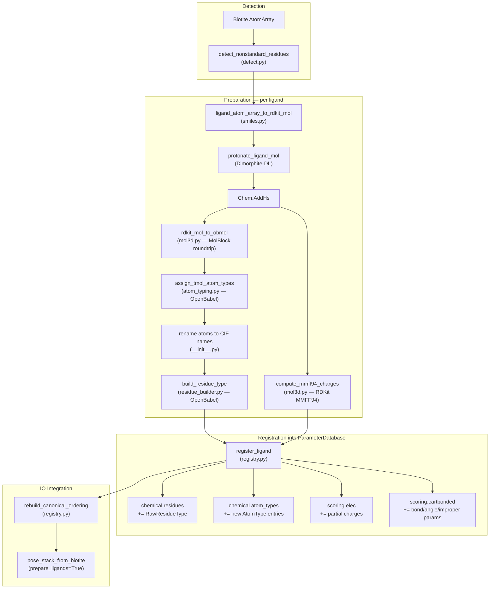

# Ligand Preparation Pipeline

Detects non-standard residues (ligands) in Biotite AtomArrays, builds
protonated 3D molecules with partial charges, assigns Rosetta-compatible
atom types, and registers the results into tmol's `ParameterDatabase` so
ligands are seamlessly loaded via `PoseStack`.

## Pipeline Overview

## Library Responsibilities

| Step | Library | Why |
|------|---------|-----|
| Mol construction from AtomArray | **RDKit** + Biotite | Direct coordinate + bond transfer, no SMILES roundtrip |
| Protonation at target pH | **RDKit** via Dimorphite-DL | `protonate_mol_variants` operates on Mol objects directly |
| Partial charges (MMFF94) | **RDKit** | `AllChem.MMFFGetMoleculeProperties` with Gasteiger fallback |
| Atom typing | **OpenBabel** | 579-line Rosetta AtomTypeClassifier port; must produce identical types |
| Residue type building | **OpenBabel** | Atom tree, internal coordinates, bond order from OBMol |

## What Gets Registered

When `register_ligand` adds a ligand to the `ParameterDatabase`:

- **Chemical DB**: A `RawResidueType` with atoms, 3-tuple bonds (with bond
  order), internal coordinates, and non-polymer chemical properties. Any new
  atom types (e.g. generic ligand types like `CS`, `CR`, `NH`) are appended
  to `chemical.atom_types`.

- **Scoring — elec**: Per-atom `PartialCharges` entries from the RDKit MMFF94
  charge computation.

- **Scoring — cartbonded**: A `CartRes` with bond length, bond angle, and
  sp2-improper parameters derived from the ligand's internal coordinates.
  No proper torsion parameters are generated (those would come from
  genbonded, which is not yet parameterized).

## File Inventory

| File | Lines | Role |
|------|------:|------|
| `__init__.py` | ~310 | `prepare_single_ligand`, `prepare_ligands`, CIF atom renaming |
| `detect.py` | ~280 | `LigandInfo`, `detect_nonstandard_residues`, CCD SMILES lookup |
| `smiles.py` | ~130 | `ligand_atom_array_to_rdkit_mol`, `protonate_ligand_mol` |
| `mol3d.py` | ~110 | `compute_mmff94_charges`, `rdkit_mol_to_obmol` |
| `atom_typing.py` | ~580 | Rosetta-style atom type assignment from OBMol |
| `residue_builder.py` | ~340 | `build_residue_type` — RawResidueType from OBMol |
| `registry.py` | ~330 | `register_ligand`, `LigandPreparationCache`, `rebuild_canonical_ordering` |
| `graph_match.py` | ~110 | VF2 heavy-atom isomorphism for CIF name mapping |
| `params_io.py` | ~180 | Rosetta `.params` file read/write |
| `chemistry_tables.py` | ~70 | H-bond/polar/sp2 atom-type sets from default DB |
| `dimorphite_dl.py` | ~1400 | Vendored Dimorphite-DL (Apache-2.0) |
