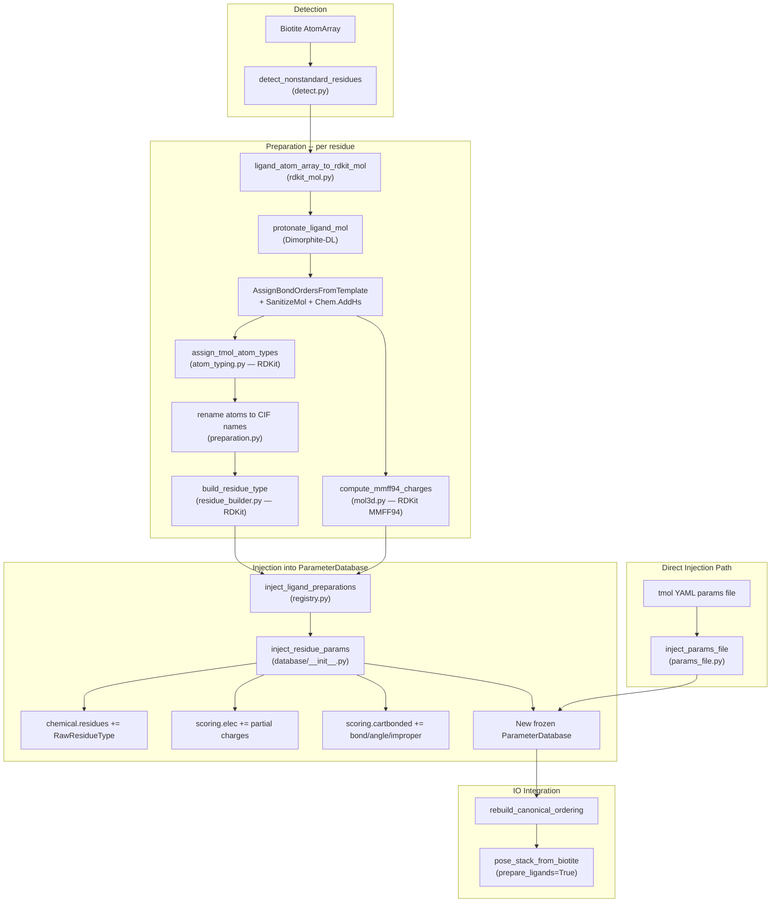

# Ligand Preparation Pipeline

Detects non-standard residues in Biotite AtomArrays, builds protonated
3D molecules with partial charges, assigns Rosetta-compatible atom types,
and returns a new `ParameterDatabase` with the residue data injected.

For file-based single-ligand preparation, prefer:

```python
from tmol.ligand import prepare_ligand_from_cif, prepare_ligand_from_mol2

param_db, co = prepare_ligand_from_cif("ligand.cif")
param_db, co = prepare_ligand_from_mol2("ligand.mol2")
```

These helpers preserve chemistry metadata (`tmol_aromatic`,
`tmol_source_subtype`, and per-atom partial charges) that can be lost in
generic rdkit<->biotite round-trips.

## Pipeline Overview



## Database Design

| Step | Library | Why |
|------|---------|-----|
| Mol construction from AtomArray | **RDKit** + Biotite | Direct coordinate + bond transfer, no SMILES roundtrip |
| Protonation at target pH | **RDKit** via Dimorphite-DL | `protonate_mol_variants` operates on Mol objects directly |
| Partial charges (MMFF94) | **RDKit** | `AllChem.MMFFGetMoleculeProperties`; failures raise an error (no fallback) |
| Atom typing | **RDKit** | Rosetta AtomTypeClassifier port operating on perceived RDKit hybridization, aromaticity, ring membership, and bond orders |
| Residue type building | **RDKit** | Atom tree, internal coordinates, bond order from Chem.Mol |

## Direct Params File Injection

Users can bypass the RDKit/OB pipeline by providing a tmol YAML params
file directly:

```python
from tmol.ligand.params_file import inject_params_file

extended_db = inject_params_file(ParameterDatabase.get_default(), "my_ligand.yaml")
```

The YAML format has three sections matching the existing database schemas:

- `residues` -- same schema as `chemical.yaml` entries
- `residue_params` -- same schema as `cartbonded.yaml`
- `atom_charge_parameters` -- same schema as `elec.yaml`

See `params_file.py` for `load_params_file`, `write_params_file`, and
`inject_params_files`.

## Quickstart: Score Protein-Ligand ddg with Existing `.tmol`

If you already have a ligand `.tmol` file, the simplest path is:

1. Inject the params file into a `ParameterDatabase`
2. Build a pose from the protein-ligand structure
3. Score block-pair interaction energy with `calculate_block_pair_ddg`

```python
import biotite.structure.io
import torch

from tmol.database import ParameterDatabase
from tmol.io.pose_stack_from_biotite import pose_stack_from_biotite
from tmol.ligand.params_file import inject_params_file
from tmol.score import beta2016_score_function
from tmol.score.score_utils import calculate_block_pair_ddg

device = torch.device("cuda" if torch.cuda.is_available() else "cpu")

tmol_path = "ligand.mmff94.tmol"
complex_pdb = "complex.pdb"

# 1) Extend default DB with your prebuilt ligand params.
param_db = inject_params_file(ParameterDatabase.get_default(), tmol_path)

# 2) Build pose using that same DB.
atom_array = biotite.structure.io.load_structure(complex_pdb)
if hasattr(atom_array, "__len__") and len(atom_array) > 1:
    atom_array = atom_array[0]

pose_stack = pose_stack_from_biotite(
    atom_array,
    device,
    param_db=param_db,
    prepare_ligands=False,
)

# 3) Build scorefxn with the same DB and compute ligand-vs-rest ddg.
sfxn = beta2016_score_function(device, param_db=param_db)

mask = torch.zeros((1, pose_stack.max_n_blocks), dtype=torch.bool, device=device)
mask[0, -1] = True  # common case: ligand is the last block

ddg = calculate_block_pair_ddg(
    pose_stack,
    mask,
    sfxn=sfxn,
    sum_terms=True,
    minimize=False,
)
print("ddg:", ddg)
```

Notes:

- `calculate_block_pair_ddg` is a Python API in `tmol.score.score_utils` (no separate CLI wrapper).
- The structure residue/atom naming must match the residue definition in your `.tmol`.
- For multi-ligand systems, build an explicit mask instead of assuming the ligand is the last block.

## Reuse, Caching, and Persistence

When processing many poses that share the same ligand topology, you can
avoid repeating full ligand preparation.

### 1) In-process reuse (automatic cache)

`prepare_ligands()` uses a process-global in-memory cache
(`LigandPreparationCache`) keyed by:

- residue name
- pH
- atom names
- element list

Within one Python process, repeated calls with the same key reuse the
prepared residue type and charges instead of recomputing them.

```python
from tmol.ligand import prepare_ligands

param_db, co = prepare_ligands(atom_array, ph=7.4)
# subsequent calls in this process with same ligand key reuse cache
param_db2, co2 = prepare_ligands(atom_array, ph=7.4)
```

### 2) Persistent reuse across sessions (write/read `.tmol` params)

The in-memory cache is not persisted across Python runs. For permanent
reuse, write prepared ligands to a params file once, then load it later.

```python
from tmol.database import ParameterDatabase
from tmol.ligand import prepare_ligands

# One-time generation
param_db = ParameterDatabase.get_default()
param_db, co = prepare_ligands(
    atom_array,
    param_db=param_db,
    ph=7.4,
    params_output="my_ligands.tmol",
)

# Later runs: inject from file and skip re-prep for those residues
param_db, co = prepare_ligands(
    atom_array,
    param_db=ParameterDatabase.get_default(),
    params_files=["my_ligands.tmol"],
)
```

You can also pass these files through IO helpers such as
`pose_stack_from_biotite(..., prepare_ligands=True, ligand_params_files=[...])`.

### 3) Reset behavior

- **Reset ligand prep cache** (current process):

```python
from tmol.ligand.registry import clear_cache

clear_cache()
```

- **Reset database to default**:

```python
from tmol.database import ParameterDatabase

param_db = ParameterDatabase.get_default()
```

`ParameterDatabase` is immutable/frozen; injection returns a new instance.
To "reset", just reacquire `get_default()` (or drop your extended instance).

## Library Responsibilities

| Step | Library |
|------|---------|
| Mol construction from AtomArray | **RDKit** + Biotite |
| Protonation at target pH | **RDKit** via Dimorphite-DL |
| Partial charges (MMFF94) | **RDKit** (no fallback; fail loud on parameterization errors) |
| Atom typing | **RDKit** (Rosetta AtomTypeClassifier port) |
| Residue type building | **RDKit** (atom tree, icoors, bond order) |

## File Inventory

| File | Lines | Role |
|------|------:|------|
| `__init__.py` | 32 | Thin public API / re-export layer |
| `preparation.py` | 434 | `prepare_single_ligand`, `prepare_ligands`, CIF atom renaming |
| `detect.py` | 641 | `NonStandardResidueInfo`, `detect_nonstandard_residues` |
| `rdkit_mol.py` | 307 | `ligand_atom_array_to_rdkit_mol`, `protonate_ligand_mol` |
| `mol3d.py` | 146 | `compute_mmff94_charges` |
| `atom_typing.py` | 1577 | Rosetta-style atom type assignment from Chem.Mol |
| `residue_builder.py` | 504 | `build_residue_type` — RawResidueType from Chem.Mol |
| `registry.py` | 400 | `inject_ligand_preparations`, `LigandPreparation`, `LigandPreparationCache` |
| `graph_match.py` | 138 | VF2 heavy-atom isomorphism for CIF name mapping |
| `params_io.py` | 180 | Rosetta `.params` file read/write (backward compat) |
| `chemistry_tables.py` | 89 | H-bond/polar/sp2 atom-type sets from default DB |
| `dimorphite_dl.py` | 1407 | Vendored Dimorphite-DL (Apache-2.0) |
