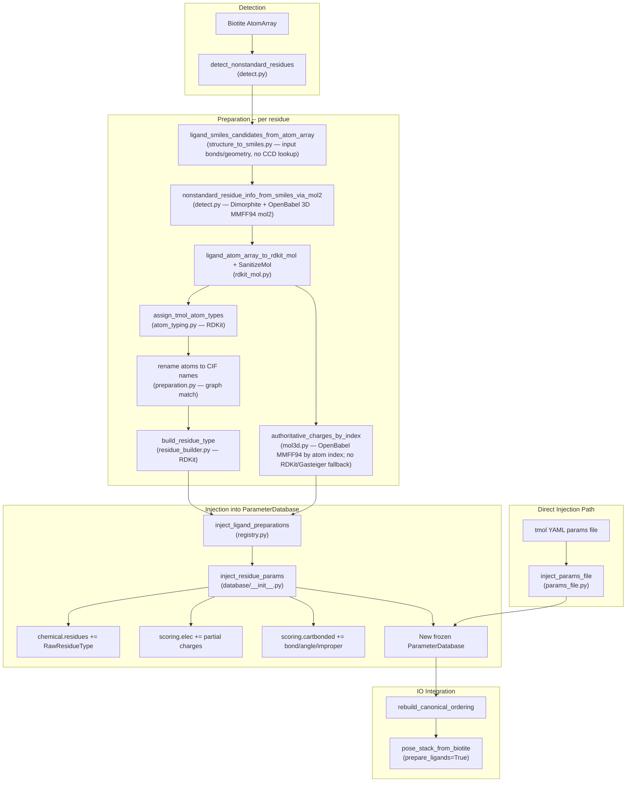

# Ligand Preparation Pipeline

Detects non-standard residues in Biotite AtomArrays, builds protonated
3D molecules with partial charges, assigns Rosetta-compatible atom types,
and returns a new `ParameterDatabase` with the residue data injected.

For file-based single-ligand preparation, prefer:

```python
from tmol.ligand import prepare_ligand_from_cif, prepare_ligand_from_mol2

param_db, co = prepare_ligand_from_cif("ligand.cif")
param_db, co = prepare_ligand_from_mol2("ligand.mol2")
```

These helpers preserve chemistry metadata (`tmol_aromatic`,
`tmol_source_subtype`, and per-atom partial charges) that can be lost in
generic rdkit<->biotite round-trips.

## Pipeline Overview



## Database Design

| Step | Library | Why |
|------|---------|-----|
| SMILES from structure | **RDKit** + Biotite | Input bonds or geometry; no CCD lookup |
| Protonation at target pH | **Dimorphite-DL** | pKa-based protonation on SMILES |
| 3D coords + MMFF94 charges | **OpenBabel** | Conformer search + force-field charges in mol2 |
| Mol construction from AtomArray | **RDKit** + Biotite | Direct coordinate + bond transfer for typing |
| Atom typing | **RDKit** | Rosetta AtomTypeClassifier port |
| Residue type building | **RDKit** | Atom tree, internal coordinates, bond order |

## Direct Params File Injection

Users can bypass the RDKit/OB pipeline by providing a tmol YAML params
file directly:

```python
from tmol.ligand.params_file import inject_params_file

extended_db = inject_params_file(ParameterDatabase.get_default(), "my_ligand.yaml")
```

The YAML format has three sections matching the existing database schemas:

- `residues` -- same schema as `chemical.yaml` entries
- `residue_params` -- same schema as `cartbonded.yaml`
- `atom_charge_parameters` -- same schema as `elec.yaml`

See `params_file.py` for `load_params_file`, `write_params_file`, and
`inject_params_files`.

## Quickstart: Score Protein-Ligand ddg with Existing `.tmol`

If you already have a ligand `.tmol` file, the simplest path is:

1. Inject the params file into a `ParameterDatabase`
2. Build a pose from the protein-ligand structure
3. Score block-pair interaction energy with `calculate_block_pair_ddg`

```python
import biotite.structure.io
import torch

from tmol.database import ParameterDatabase
from tmol.io.pose_stack_from_biotite import pose_stack_from_biotite
from tmol.ligand.params_file import inject_params_file
from tmol.score import beta2016_score_function
from tmol.score.score_utils import calculate_block_pair_ddg

device = torch.device("cuda" if torch.cuda.is_available() else "cpu")

tmol_path = "ligand.mmff94.tmol"
complex_pdb = "complex.pdb"

# 1) Extend default DB with your prebuilt ligand params.
param_db = inject_params_file(ParameterDatabase.get_default(), tmol_path)

# 2) Build pose using that same DB.
atom_array = biotite.structure.io.load_structure(complex_pdb)
if hasattr(atom_array, "__len__") and len(atom_array) > 1:
    atom_array = atom_array[0]

pose_stack = pose_stack_from_biotite(
    atom_array,
    device,
    param_db=param_db,
    prepare_ligands=False,
)

# 3) Build scorefxn with the same DB and compute ligand-vs-rest ddg.
sfxn = beta2016_score_function(device, param_db=param_db)

mask = torch.zeros((1, pose_stack.max_n_blocks), dtype=torch.bool, device=device)
mask[0, -1] = True  # common case: ligand is the last block

ddg = calculate_block_pair_ddg(
    pose_stack,
    mask,
    sfxn=sfxn,
    sum_terms=True,
    minimize=False,
)
print("ddg:", ddg)
```

Notes:

- `calculate_block_pair_ddg` is a Python API in `tmol.score.score_utils` (no separate CLI wrapper).
- The structure residue/atom naming must match the residue definition in your `.tmol`.
- For multi-ligand systems, build an explicit mask instead of assuming the ligand is the last block.
- Build the score function from the **ligand-extended** database
  (`beta2016_score_function(device, param_db=context.parameter_database)`),
  not the default database. A freshly prepared ligand block type has no
  scoring parameters in the default database, so scoring against it silently
  contributes nothing.

## User-defined ligand fragmentation

To score different parts of a ligand independently, add an integer
`tmol_fragment_id` annotation to the input Biotite `AtomArray`. Assign every
atom in one ligand residue to a fragment. tmol prepares the complete ligand
first, then copies its atom types and scoring parameters into connected
fragment block types.

For a ligand named `XYZ`, fragment IDs `1`, `2`, and `3` produce block types
named `XYZ.1`, `XYZ.2`, and `XYZ.3`.

```python
import biotite.structure as struc
import biotite.structure.io
import numpy as np
import torch

from tmol.database import ParameterDatabase
from tmol.io.pose_stack_from_biotite import pose_stack_from_biotite
from tmol.score import beta2016_score_function
from tmol.score.score_utils import calculate_fragment_interactions

device = torch.device("cuda" if torch.cuda.is_available() else "cpu")
structure = biotite.structure.io.load_structure("complex.cif")
if isinstance(structure, struc.AtomArrayStack):
    structure = structure[0]

# Define the fragment assignment by atom name. This example assumes one XYZ
# residue; use residue/chain IDs too when the structure contains duplicates.
xyz_fragments = {
    "C1": 1,
    "C2": 1,
    "O1": 1,
    "C3": 2,
    "C4": 2,
    "N1": 2,
}
fragment_ids = np.zeros(structure.array_length(), dtype=np.int32)
is_xyz = structure.res_name == "XYZ"
for atom_name, fragment_id in xyz_fragments.items():
    fragment_ids[is_xyz & (structure.atom_name == atom_name)] = fragment_id
assert np.all(fragment_ids[is_xyz] > 0), "assign every XYZ atom to a fragment"
structure.set_annotation("tmol_fragment_id", fragment_ids)

pose, context = pose_stack_from_biotite(
    structure,
    device,
    param_db=ParameterDatabase.get_default(),
    prepare_ligands=True,
    return_context=True,
)

# Select all non-fragment blocks as the interaction partner.
mapping = pose.fragmented_ligand_mapping
partner_mask = pose.block_type_ind >= 0
for record in mapping.blocks:
    partner_mask[record.pose_index, record.block_index] = False

# The score function must use the ligand-extended database from the build context.
sfxn = beta2016_score_function(
    device,
    param_db=context.parameter_database,
)
interactions = calculate_fragment_interactions(
    pose,
    partner_mask,
    sfxn=sfxn,
    sum_terms=True,
)

for index, record in enumerate(interactions.mapping):
    print(record.fragment_name, interactions.scores[:, index])
```

`interactions.scores` has shape `[n_poses, n_fragments]` when
`sum_terms=True`, or `[n_score_terms, n_poses, n_fragments]` otherwise.
`interactions.mapping` gives the fragment name, original residue identity,
and pose block index for each score column. Summing the fragment interaction
columns gives the fragmented ligand-versus-partner block-pair ddG.

Fragment layouts currently have these correctness constraints:

- each fragment is connected and contains at least three heavy atoms;
- each fragment has at most four connections to other fragments;
- no atom participates in more than one cut bond; and
- no four-atom bonded path contains more than one cut.

The final two rules prevent bonded angles, torsions, and impropers from spanning
three or more blocks. Current bonded scoring kernels evaluate terms within one
block or across one connection between two blocks. tmol rejects unsupported
layouts rather than silently omitting those energy and gradient terms. In
practice, choose chemically meaningful fragments of roughly 3–8 heavy atoms
and keep adjacent cut bonds separated.

Additional requirements:

- Fragment IDs must be non-negative integers and at least two IDs must occur.
- All instances of a residue name in one input must use the same fragment
  layout.
- Generated names such as `XYZ.1` must not already identify different
  chemistry in the active parameter database.
- The mapping is attached automatically as
  `pose.fragmented_ligand_mapping`; users normally should not call the
  lower-level fragmentation functions directly.

## Troubleshooting

### `strict_ligands` (default: fail loudly)

When `prepare_ligands=True`, ligand preparation is **strict by default**: if a
detected non-standard residue cannot be prepared and registered, the call
raises `LigandPreparationError` instead of silently continuing. This prevents
the common footgun of loading a protein-ligand complex, getting a pose with the
ligand missing, and computing a meaningless (often `0.0`) ddG.

Pass `strict_ligands=False` to restore the older warn-and-skip behavior, where
unpreparable ligands are logged and dropped:

```python
pose_stack, context = pose_stack_from_biotite(
    atom_array,
    device,
    prepare_ligands=True,
    strict_ligands=False,  # warn and drop instead of raising
    return_context=True,
)
```

A residue triggers the strict error when it is skipped (it contains metal atoms
or is covalently linked to another residue) or when preparation fails outright
(no derivable SMILES, atom typing, or residue construction error). A successful
but imperfect "best-effort" name match is still logged as a warning rather than
raised, since the ligand is loaded in that case.

### `Unrecognized 3lc <NAME>` warning

This warning comes from pose construction
(`tmol/io/pose_stack_from_biotite.py`), not ligand prep. It means a residue with
that 3-letter code is not in the active `CanonicalOrdering`, so the residue is
**stripped from the structure**. If you see it for a ligand you expected to
score, the ligand never made it into the pose. The usual causes are:

- `prepare_ligands=False` (ligands are never registered), or
- `prepare_ligands=True, strict_ligands=False` and the ligand was skipped or
  failed preparation (the preceding warning explains why).

With the strict default (`strict_ligands=True`), this turns into a
`LigandPreparationError` at preparation time with an actionable message.

### Ligand close to the protein is dropped as "covalently linked"

Protein-ligand complexes with tight binding-pocket contacts, hydrogen bonds, or
clashes in unminimized models used to be misclassified as covalently linked and
skipped. Covalent detection now trusts the explicit bond table for all residues
and only applies the spatial-proximity fallback to polymer-linking residue
types (modified amino acids/nucleotides, glycans). Genuine non-polymer ligands
are no longer flagged by proximity alone.

## Reuse, Caching, and Persistence

When processing many poses that share the same ligand topology, you can
avoid repeating full ligand preparation.

### 1) In-process reuse (automatic cache)

`prepare_ligands()` uses a process-global in-memory cache
(`LigandPreparationCache`) keyed by:

- residue name
- pH
- `sample_proton_chi`
- atom names
- element list

Within one Python process, repeated calls with the same key reuse the
prepared residue type and charges instead of recomputing them.

```python
from tmol.ligand import prepare_ligands

param_db, co = prepare_ligands(atom_array, ph=7.4)
# subsequent calls in this process with same ligand key reuse cache
param_db2, co2 = prepare_ligands(atom_array, ph=7.4)
```

### 2) Persistent reuse across sessions (write/read `.tmol` params)

The in-memory cache is not persisted across Python runs. For permanent
reuse, write prepared ligands to a params file once, then load it later.

```python
from tmol.database import ParameterDatabase
from tmol.ligand import prepare_ligands

# One-time generation
param_db = ParameterDatabase.get_default()
param_db, co = prepare_ligands(
    atom_array,
    param_db=param_db,
    ph=7.4,
    params_output="my_ligands.tmol",
)

# Later runs: inject from file and skip re-prep for those residues
param_db, co = prepare_ligands(
    atom_array,
    param_db=ParameterDatabase.get_default(),
    params_files=["my_ligands.tmol"],
)
```

You can also pass these files through IO helpers such as
`pose_stack_from_biotite(..., prepare_ligands=True, ligand_params_files=[...])`.

### 3) Reset behavior

- **Reset ligand prep cache** (current process):

```python
from tmol.ligand.registry import clear_cache

clear_cache()
```

- **Reset database to default**:

```python
from tmol.database import ParameterDatabase

param_db = ParameterDatabase.get_default()
```

`ParameterDatabase` is immutable/frozen; injection returns a new instance.
To "reset", just reacquire `get_default()` (or drop your extended instance).

## Library Responsibilities

| Step | Library |
|------|---------|
| SMILES from structure | **RDKit** + Biotite |
| Protonation | **Dimorphite-DL** |
| 3D + MMFF94 charges | **OpenBabel** (mol2) |
| Atom typing | **RDKit** (Rosetta port) |
| Residue building | **RDKit** |

## File Inventory

| File | Role |
|------|------|
| `preparation.py` | `prepare_ligands`, single-ligand helpers, CIF rename |
| `fragmentation.py` | User annotations, fragment block types/connections, pose mapping |
| `detect.py` | `NonStandardResidueInfo`, detection, mol2/SMILES readers |
| `structure_to_smiles.py` | SMILES candidates from AtomArray |
| `openbabel_compat.py` | SMILES→mol2, mol2 read fallbacks |
| `rdkit_mol.py` | AtomArray → RDKit Mol |
| `mol3d.py` | OpenBabel MMFF94 charges by atom index |
| `atom_typing.py` | Rosetta-style atom type assignment |
| `chi_topology.py` | Rotatable bonds / PROTON_CHI |
| `residue_builder.py` | `RawResidueType` from Chem.Mol |
| `registry.py` | Cache + `ParameterDatabase` injection |
| `params_file.py` | Load/inject `.tmol` YAML |
| `params_io.py` | Write `.params`/`.tmol`; read Rosetta `.params` |
| `graph_match.py` | VF2 CIF name mapping |
| `equivalence.py` | Parity comparison helpers |
