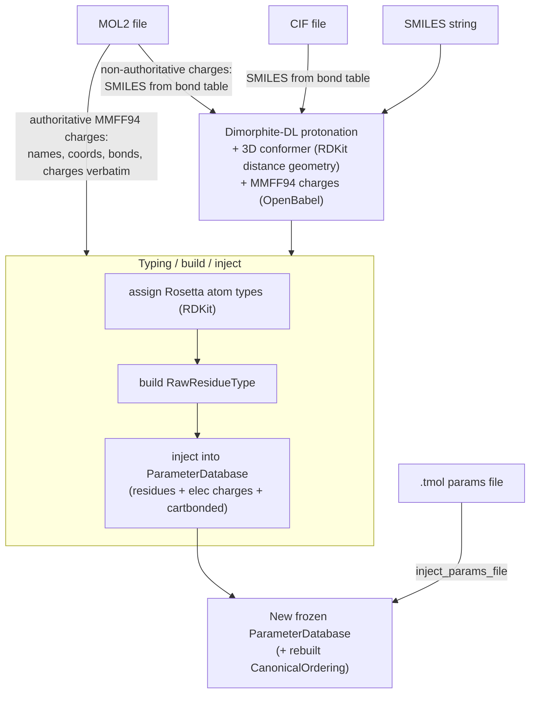

# Ligand Preparation Pipeline

Turns a non-standard (non-polymer) residue into a fully parameterized tmol
residue type — protonated 3D coordinates, MMFF94 partial charges,
Rosetta-compatible atom types, and cartbonded parameters — and injects it into
a `ParameterDatabase` so the ligand can be scored and minimized like any other
residue.

## Quick Usage

There are three ways to inject a ligand, one per input format. Each returns a
new `(ParameterDatabase, CanonicalOrdering)`; the input database is never
mutated.

```python
from tmol.ligand import (
    prepare_ligand_from_mol2,
    prepare_ligand_from_cif,
    prepare_ligand_from_smiles,
)

# 1) MOL2 — richest input. With an authoritative charge model (MMFF94), atom
#    names, coordinates, bond orders, and partial charges are read verbatim; no
#    SMILES or 3D-generation step. A mol2 with a non-authoritative charge model
#    (e.g. GASTEIGER) instead falls back to the derived-SMILES path below.
param_db, co = prepare_ligand_from_mol2("ligand.mol2")

# 2) CIF — the bond table drives a derived SMILES, which runs through the full
#    prep pipeline (protonation, 3D conformer, MMFF94 charges).
param_db, co = prepare_ligand_from_cif("ligand.cif")

# 3) SMILES — no input geometry. Dimorphite-DL protonates at the target pH and
#    a 3D conformer + MMFF94 charges are generated.
param_db, co = prepare_ligand_from_smiles("c1ccccc1C(=O)O", res_name="BEN")
```

To detect and prepare **every** non-standard residue in a structure at once
(the path used by IO), pass a biotite `AtomArray` to `prepare_ligands`, or let
`pose_stack_from_biotite(..., prepare_ligands=True)` call it for you. The
`AtomArray` is a biotite structure loaded from a CIF or PDB file:

```python
import biotite.structure.io
from tmol.ligand import prepare_ligands

atom_array = biotite.structure.io.load_structure("complex.cif")
if hasattr(atom_array, "__len__") and len(atom_array) > 1:
    atom_array = atom_array[0]  # first model of a multi-model file

param_db, co = prepare_ligands(atom_array, ph=7.4)
```

**On PDB inputs:** tmol accepts PDB for structures generally, but PDB does not
carry reliable bond orders. Deriving ligand parameters requires an input that
describes bond geometry — a MOL2, a CIF with a bond table, or a SMILES. Load
the ligand from one of those formats even when the rest of the complex is a PDB.

- `calculate_block_pair_ddg` is a Python API in `tmol.score.score_utils` (no separate CLI wrapper).
- The structure residue/atom naming must match the residue definition in your `.tmol`.
- For multi-ligand systems, build an explicit mask instead of assuming the ligand is the last block.
- Build the score function from the **ligand-extended** database
  (`beta2016_score_function(device, param_db=context.parameter_database)`),
  not the default database. A freshly prepared ligand block type has no
  scoring parameters in the default database, so scoring against it silently
  contributes nothing.

## User-defined ligand fragmentation

To score different parts of a ligand independently, add an integer
`tmol_fragment_id` annotation to the input Biotite `AtomArray`. Assign every
atom in one ligand residue to a fragment. tmol prepares the complete ligand
first, then copies its atom types and scoring parameters into connected
fragment block types.

For a ligand named `XYZ`, fragment IDs `1`, `2`, and `3` produce block types
named `XYZ.1`, `XYZ.2`, and `XYZ.3`.

```python
import biotite.structure as struc
import biotite.structure.io
import numpy as np
import torch

from tmol.database import ParameterDatabase
from tmol.io.pose_stack_from_biotite import pose_stack_from_biotite
from tmol.score import beta2016_score_function
from tmol.score.score_utils import calculate_fragment_interactions

device = torch.device("cuda" if torch.cuda.is_available() else "cpu")
structure = biotite.structure.io.load_structure("complex.cif")
if isinstance(structure, struc.AtomArrayStack):
    structure = structure[0]

# Define the fragment assignment by atom name. This example assumes one XYZ
# residue; use residue/chain IDs too when the structure contains duplicates.
xyz_fragments = {
    "C1": 1,
    "C2": 1,
    "O1": 1,
    "C3": 2,
    "C4": 2,
    "N1": 2,
}
fragment_ids = np.zeros(structure.array_length(), dtype=np.int32)
is_xyz = structure.res_name == "XYZ"
for atom_name, fragment_id in xyz_fragments.items():
    fragment_ids[is_xyz & (structure.atom_name == atom_name)] = fragment_id
assert np.all(fragment_ids[is_xyz] > 0), "assign every XYZ atom to a fragment"
structure.set_annotation("tmol_fragment_id", fragment_ids)

pose, context = pose_stack_from_biotite(
    structure,
    device,
    param_db=ParameterDatabase.get_default(),
    prepare_ligands=True,
    return_context=True,
)

# Select all non-fragment blocks as the interaction partner.
mapping = pose.fragmented_ligand_mapping
partner_mask = pose.block_type_ind >= 0
for record in mapping.blocks:
    partner_mask[record.pose_index, record.block_index] = False

# The score function must use the ligand-extended database from the build context.
sfxn = beta2016_score_function(
    device,
    param_db=context.parameter_database,
)
interactions = calculate_fragment_interactions(
    pose,
    partner_mask,
    sfxn=sfxn,
    sum_terms=True,
)

for index, record in enumerate(interactions.mapping):
    print(record.fragment_name, interactions.scores[:, index])
```

`interactions.scores` has shape `[n_poses, n_fragments]` when
`sum_terms=True`, or `[n_score_terms, n_poses, n_fragments]` otherwise.
`interactions.mapping` gives the fragment name, original residue identity,
and pose block index for each score column. Summing the fragment interaction
columns gives the fragmented ligand-versus-partner block-pair ddG.

Fragment layouts currently have these correctness constraints:

- each fragment is connected and contains at least three heavy atoms;
- each fragment has at most four connections to other fragments;
- no atom participates in more than one cut bond;
- no four-atom bonded path contains more than one cut; and
- cuts do not pass directly through hbond/lk_ball acceptor geometry.

The cut-sharing rules prevent bonded angles, torsions, and impropers from
spanning three or more blocks. The acceptor rule keeps hbond/lk_ball frame
geometry local to a fragment. Current bonded scoring kernels evaluate terms
within one block or across one connection between two blocks. tmol rejects
unsupported layouts rather than silently omitting those energy and gradient
terms. In practice, choose chemically meaningful fragments of roughly 3–8 heavy
atoms and keep adjacent cut bonds separated.

Additional requirements:

- Fragment IDs must be integers. Use `0` only outside fragmented residues; every
  atom in a fragmented residue must have a positive fragment ID, and at least two
  positive IDs must occur.
- All instances of a residue name in one input must use the same fragment
  layout.
- Generated names such as `XYZ.1` must not already identify different
  chemistry in the active parameter database.
- The mapping is attached automatically as
  `pose.fragmented_ligand_mapping`; users normally should not call the
  lower-level fragmentation functions directly.

### Recombining and dumping fragments

Fragmentation only changes the in-memory block layout used for scoring.
`write_pose_stack_pdb()` and `biotite_from_pose_stack()` restore each
fragmented ligand's original residue name, number, chain, and insertion code by
default, so dumped coordinates contain the original ligand residue:

```python
from tmol import write_pose_stack_pdb
from tmol.io.pose_stack_from_biotite import biotite_from_pose_stack

write_pose_stack_pdb(pose, "scored_complex.pdb")
restored = biotite_from_pose_stack(pose, context.canonical_ordering)
```

Pass `merge_fragments=False` to either function to inspect the separate
fragment residues. `tmol.ligand.recombine_fragmented_ligands()` provides the
same residue-identity restoration for an already exported Biotite structure.
This export operation does not rebuild a new single-block scoring pose; the
original pose remains fragmented so per-fragment interactions can still be
calculated.

## Troubleshooting

### Reuse the context (preferred)

When scoring many poses that share the same ligand(s), build the expensive,
structure-independent `PoseBuildContext` **once** and reuse it. This is
the preferred reuse path: it skips rebuilding the parameter database, canonical
ordering, and packed block types on every structure.

```python
from tmol.io.pose_stack_from_biotite import (
    build_context_from_biotite,
    pose_stack_from_biotite,
)

context = build_context_from_biotite(struct0, device, prepare_ligands=True)
for struct in structures:
    pose_stack = pose_stack_from_biotite(struct, device, context=context)
```

### Persist to `.tmol` (for manual edits or cold reuse)

Preparation (SMILES → 3D → typing) is expensive and, for edge-case
chemistries, sometimes wrong. Write prepared ligands to a `.tmol` params file,
hand-edit if needed, then inject that file instead of re-preparing. This is the
path to take when you want to inspect or manually correct a ligand definition.

```python
from tmol.database import ParameterDatabase
from tmol.ligand import prepare_ligands

# Write once
param_db, co = prepare_ligands(
    atom_array, ph=7.4, params_output="my_ligands.tmol"
)

# Reuse later (optionally after editing the file by hand)
param_db, co = prepare_ligands(
    atom_array,
    param_db=ParameterDatabase.get_default(),
    params_files=["my_ligands.tmol"],
)
```

The same files can be passed through IO:
`pose_stack_from_biotite(..., prepare_ligands=True, ligand_params_files=[...])`.
For a `.tmol` you already have, `inject_params_file(param_db, "my_ligand.tmol")`
extends a database directly. Prefer context reuse over file round-trips when the
ligand topology is fixed within a run; use `.tmol` when you need persistence
across runs or manual control.

## Pipeline Overview

All three input modes converge on a single typing/build/inject core.


```mermaid
flowchart TD
    M2["MOL2 file"] -->|authoritative MMFF94 charges:\nnames, coords, bonds, charges verbatim| CORE
    M2 -->|non-authoritative charges:\nSMILES from bond table| SM
    CIF["CIF file"] -->|SMILES from bond table| SM
    SMI["SMILES string"] --> SM

    SM["Dimorphite-DL protonation\n+ 3D conformer (RDKit distance geometry)\n+ MMFF94 charges (OpenBabel)"] --> CORE

    subgraph CORE [Typing / build / inject]
        T["assign Rosetta atom types (RDKit)"] --> B["build RawResidueType"]
        B --> INJ["inject into ParameterDatabase\n(residues + elec charges + cartbonded)"]
    end

    INJ --> DB["New frozen ParameterDatabase\n(+ rebuilt CanonicalOrdering)"]

    TMOL[".tmol params file"] -->|inject_params_file| DB
```

The `.tmol` path bypasses typing/build entirely — it injects already-prepared
residue, charge, and cartbonded records straight into the database.

## Troubleshooting

A ligand that "scores as 0" or goes missing almost always means it never made
it into the pose. Failure modes, in order of likelihood:

- **Ligand dropped during preparation.** With `prepare_ligands=True`,
  preparation is **strict by default** (`strict_ligands=True`): an unpreparable
  residue raises `LigandPreparationError` rather than silently disappearing. A
  residue is dropped when it is *skipped* (contains metal atoms, or is
  covalently linked to another residue) or when preparation *fails* (no
  derivable SMILES, atom-typing failure, or residue-build error). Pass
  `strict_ligands=False` to restore warn-and-drop behavior. (A successful but
  imperfect atom-name match only warns — the ligand still loads.)

- **`Unrecognized 3lc <NAME>`.** Emitted by pose construction, not prep: the
  3-letter code is not in the active `CanonicalOrdering`, so the residue is
  stripped from the structure. Causes: `prepare_ligands=False` (ligands are
  never registered), or `prepare_ligands=True, strict_ligands=False` with a
  ligand that was skipped/failed (see the preceding warning for why). Under the
  strict default this surfaces earlier as a `LigandPreparationError`.

- **Scoring against the default database.** A freshly prepared ligand block type
  has no scoring parameters in the *default* database. Always build the score
  function from the **ligand-extended** database returned by preparation
  (`beta2016_score_function(device, param_db=param_db)`), or scoring silently
  contributes nothing.

- **Ligand wrongly flagged "covalently linked."** Historically, tight
  binding-pocket contacts in unminimized models could be misread as covalent
  links. Covalent detection now trusts the explicit bond table and only applies
  the spatial-proximity fallback to polymer-linking residue types (modified
  amino acids/nucleotides, glycans); genuine non-polymer ligands are no longer
  flagged by proximity alone.

## File Inventory

| File | Role |
|------|------|
| `preparation.py` | `prepare_ligands`, single-ligand `from_{mol2,cif,smiles}` helpers, CIF rename |
| `detect.py` | `NonStandardResidueInfo`, non-standard residue detection, mol2/SMILES readers |
| `structure_to_smiles.py` | SMILES from an AtomArray bond table (no geometry perception, no CCD lookup) |
| `fragmentation.py` | Fragment annotations, fragment block types/connections, pose mapping |
| `dimorphite_dl.py` | pKa-based protonation-state enumeration on SMILES |
| `conformer_generation.py` | 3D coordinates via RDKit distance geometry (replaces OpenBabel `make3D`) |
| `generated_geometry.py` | Corrections to known systematic errors in generated conformers |
| `openbabel_compat.py` | SMILES→mol2 (conformer + MMFF94 charges), mol2 read fallbacks |
| `mol3d.py` | OpenBabel MMFF94 charges by atom index |
| `rdkit_mol.py` | AtomArray → RDKit `Mol` |
| `mol2_names.py` | Rosetta-style disambiguation of duplicate Tripos atom names |
| `atom_typing.py` | Rosetta `generic_potential` atom-type assignment (RDKit) |
| `chi_topology.py` | Rotatable bonds / `PROTON_CHI` |
| `chemistry_tables.py` | DB-backed atom-class and hbond lookup tables from the chemical DB |
| `residue_builder.py` | `RawResidueType` from a `Chem.Mol` (atom tree, ICs, bond order) |
| `registry.py` | `ParameterDatabase` injection, cartbonded params |
| `params_file.py` | Load/inject `.tmol` YAML params |
| `params_io.py` | Write `.params`/`.tmol`; read Rosetta `.params` |
